# Multimodal System One

**A research project for learning fast, typed decisions directly from speech, sounds, screenshots, and language on a MacBook.**

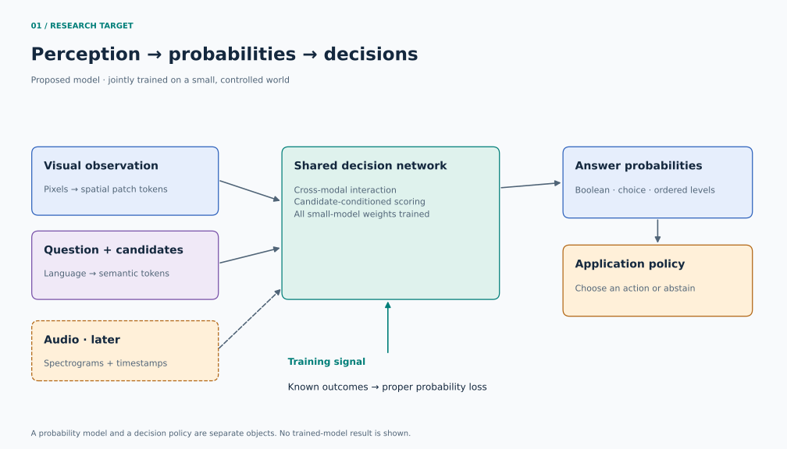

> **Stage: first unified neural prototype, with measured limits.** One 668,097-parameter model now reads recorded audio, pixels, question text, and candidate descriptions. It outperforms matched unimodal controls on the generated-panel task, but fails the held-out command–color composition test. General speech, real-browser grounding, and Jev-equivalent capabilities remain unestablished.

The first goal is a small model whose weights, data, losses, and failure modes we can understand. It should answer bounded questions about observations, return a probability distribution over the declared answers, and support abstention in the surrounding software. The initial target machine is an Apple M4 Pro with 48 GB of unified memory. The reports below record training budgets and loaded inference latency for the implemented prototypes.

**Current target:** speech/audio classification and screen understanding for computer/browser use. Define real-data evals for each modality and for paired audio–screen decisions before model search. Use compact pretrained input encoders with trainable fusion/decision heads for the practical track, while retaining small from-scratch controls to learn the fundamentals. The image/text shapes study below is an algorithm control, not the application acceptance test.

This recommendation is an engineering judgment from the sources below. The best architecture for our data and compute budget remains an empirical question.

## The unified model is now implemented

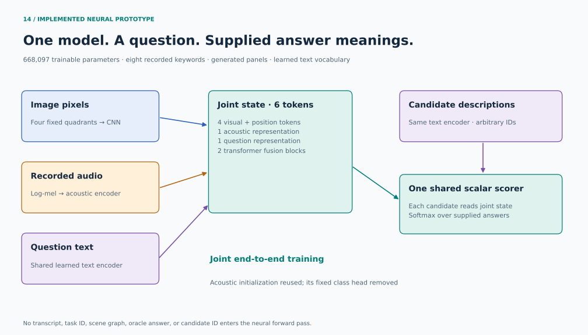

The new model has one acoustic encoder, one shared visual encoder, a text encoder used for questions and candidate meanings, two fusion blocks, and **one scalar scoring head reused for every supplied candidate**. Its output matrix has no fixed row for each answer class. No transcript, task ID, scene graph, oracle answer, or candidate ID enters the neural forward pass.

All components are jointly trained. The acoustic representation starts from our earlier small speech model; its fixed eight-class head is removed. The first task combines real recorded keywords with generated 2×2 symbol panels. This is a controlled algorithm proof, not a real-screen replacement for the failed grounding baseline below.

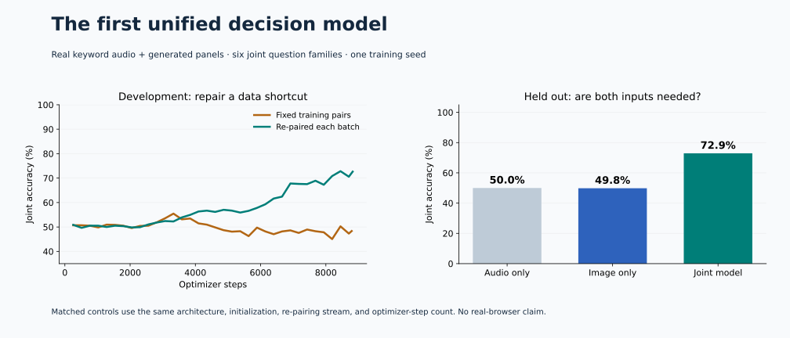

| Held-out test | Joint model | Audio only | Image only |
|---|---:|---:|---:|
| New speakers and panels | **72.92%** | 50.00% | 49.83% |
| New question phrasing | **72.57%** | 50.00% | 49.83% |
| Moved controls | **73.96%** | 51.04% | 51.04% |
| Held command–color combinations | **45.66% — fails** | 48.44% | 48.87% |

Scores average six question families; the first row is 1,152 related questions over 192 scenes from 134 unseen speakers. Controls use the same architecture, initialization, training sampling stream, and 8,822 optimizer steps. The joint model gains about 23 percentage points on the first slice. Candidate permutation produced zero logit difference; question-batch isolation differed by less than `2e-6`.

**Compositional generalization is still weak.** The held-combination result and deteriorated confidence prevent a broad capability claim. Scope is eight spoken words, generated panels, known question families, and a 43-token learned text vocabulary. This is our independently designed supervised model; it does not reproduce Jev's undisclosed RLCD.

Loaded-model p95 processing was **9.84 ms**, including preprocessing and all neural stages, after the full audio clip was available. Listening duration and checkpoint loading are excluded. See [all results and limitations](reports/joint-v2/README.md), the [architecture/API guide](docs/research/native-joint-model.md), and the [preserved development record](docs/research/joint-development.md).

```bash
uv sync --locked --group docs
uv run mmso prepare speech_keywords
uv run mmso joint-prepare
uv run python scripts/run_joint_demo.py
```

The demo answers five questions about the same audio/panel through the public API. Its input was fixed before test evaluation. [Inputs](examples/joint-demo-input.json), [model output](examples/joint-demo-output.json), and [independent answer audit](examples/joint-demo-audit.json) are saved separately. The oracle is used for the audit, not prediction.

## Earlier real-data baseline controls

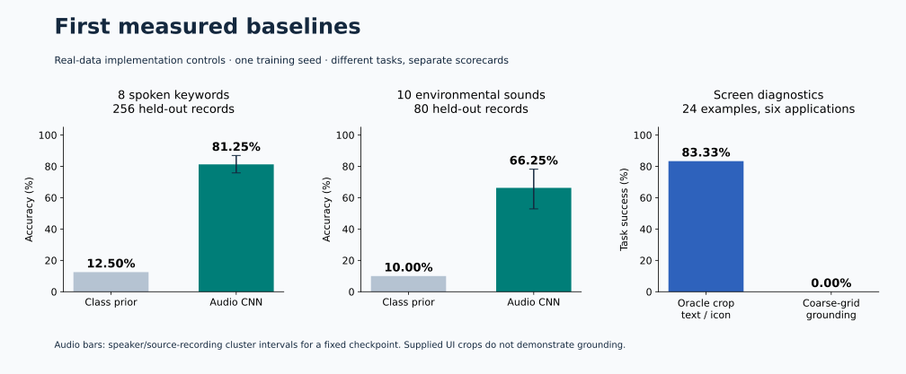

| Pilot task | Held-out result | Scope |
|---|---|---|
| Eight spoken keywords | **81.25%** on 256 records | Custom speaker-disjoint split; 89,640 parameters trained from scratch |
| Ten environmental sounds | **66.25%** on 80 clips | Custom source-fold split; 89,770 parameters trained from scratch |
| Text/icon classification | **20/24** supplied target crops | Generic frozen CLIP; target location is given |
| Screen grounding | **0/24** | Center and coarse-grid controls; only 1/24 targets is reachable by a grid-center candidate |

These are three separate baseline runs, not a joint multimodal model or official benchmark result. One duplicate pair exists within speech test and another within calibration; no media or speaker group crosses splits. The [full report](reports/pilot-v1/README.md) includes a unique-media sensitivity, confidence quality, timing boundaries, provenance, and limitations.

```bash
uv sync --locked --group docs
uv run mmso prepare all
uv run python -m unittest discover -s tests -v
uv run mmso score evals/manifests/speech_keywords.jsonl reports/speech-cnn-v1/predictions.jsonl
```

See the [runnable eval guide](evals/README.md) for training, saved-checkpoint inference, and scoring all four task kinds. Downloads stay local under `data/`; the small trained checkpoints, manifests, predictions, and reports are versioned.

## Read the project

- [Developer API](docs/developer-api.md), [interface design and sources](docs/research/developer-interface.md)
- [The decision we want to learn](#the-decision-we-want-to-learn)
- [Audio, screens, and real-world evals](#audio-screens-and-real-world-evals)
- [Architecture and alternatives](#architecture-and-alternatives)
- [The probability objective](#the-probability-objective)
- [Data that requires multiple modalities](#data-that-requires-multiple-modalities)
- [Research that improves its own search](#research-that-improves-its-own-search)
- [MacBook implementation plan](#macbook-implementation-plan)
- [Evidence and next milestones](#evidence-and-next-milestones)
- [Annotated reading map](docs/research/reading-map.md), [decision register](docs/research/decisions.md), [experiment specification](docs/research/experiment-plan.md)

## The decision we want to learn

For observations $x$, a question $q$, and candidate descriptions $C=\{c_1,\ldots,c_K\}$, learn:

$$
p_\theta(y=k\mid x,q,C).
$$

Here, **System One** is our operational target: direct, bounded predictions with a short inference path. It is not a claim about human cognition, universal intelligence, or a new mathematical model class.

TypeSafe's Jev motivates the interface: structured questions and probabilistic answers. Its documented input is currently text-only. Its public training overview names RLCD without specifying a reproducible training recipe. This project investigates an independent multimodal design; it does not claim to implement Jev's internals. [Jev interface](https://docs.typesafe.ai/concepts/system-one), [RLCD overview](https://docs.typesafe.ai/introduction/machine-learning-primer).

### What “native multimodal” means here

Images enter as pixel-derived tokens, language as text embeddings, and audio as waveform-derived or spectrogram features. Their representations interact in a trainable prediction network. The from-scratch track updates all input pathways; the practical track may initially freeze pretrained encoders and train fusion/heads. Separate modality-specific input stems are compatible with native input, but frozen representations must not be described as jointly learned here.

There are two distinct development tracks:

| Track | What is learned | What it can establish |
|---|---|---|
| **A · Fundamentals** | All small-model weights, from random initialization | Multimodal learning on a controlled task distribution |
| **B · Practical transfer** | A decision head, fusion layers, or adapters over pretrained encoders | Useful decisions on richer inputs, with inherited pretraining knowledge |

A supplies small learnability controls; B is the practical path for real speech and screens. Define evals for both at the start. A's limited vocabulary and generated scenes do not establish open-domain instruction following. Report the tracks separately, including pretrained parameter counts and data provenance.

### Output contract

| Primitive | Learned output | Software representation |
|---|---|---|
| Boolean | Bernoulli probability | `p_true` in `[0, 1]` |
| Choice | Categorical distribution over supplied candidates | Candidate ID plus all probabilities |
| Ordered score | Distribution over ordered rubric levels | Level probabilities and their weighted mean |
| Multi-label events | Independent probabilities for co-occurring labels | One probability per event; no sum-to-one requirement |

Initially, an ordered score can use a categorical head; an ordinal loss is a later comparison. A valid schema is a property of the serializer. Correctness and calibration require separate measurement.

The following is an **illustrative future response**, not a model result:

```json
{
  "type": "choice",
  "probabilities": {"left": 0.12, "right": 0.78, "stay": 0.10},
  "prediction": "right",
  "decision": "abstain",
  "policy": {"min_probability": 0.90},
  "calibration_id": "illustration-only"
}
```

Abstention is separate from the candidate labels. A softmax always allocates its mass somewhere, even when every supplied option is unsuitable. The v1 data contract supplies an exhaustive answer set, with an explicit `none` answer where the task requires it. Open-set rejection is an additional research problem.

## Audio, screens, and real-world evals

**Evals are part of the design.** The application now has four core suites: spoken intent, acoustic events, screen understanding, and joint audio–screen decisions. Synthetic data is useful for controlled interventions and debugging. Real recordings and screenshots are necessary to assess the intended behavior.

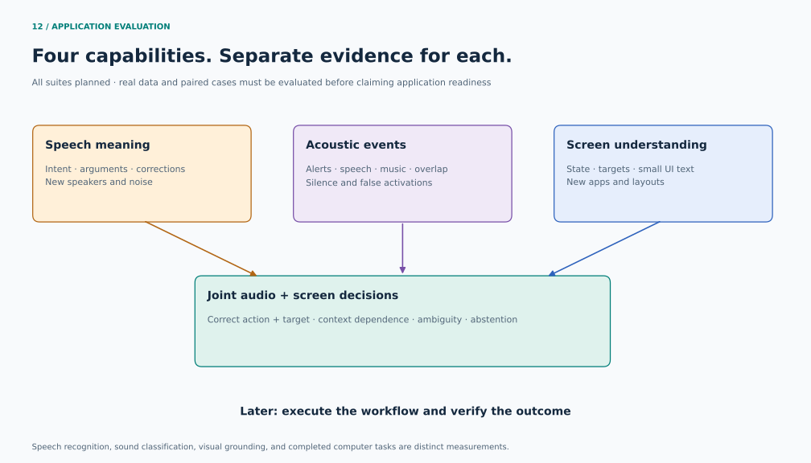

| Capability | First evidence source | What we measure |
|---|---|---|
| Spoken meaning | [Speech Commands](https://www.tensorflow.org/datasets/catalog/speech_commands) for mechanics; [SLURP](https://github.com/pswietojanski/slurp) or [Fluent Speech Commands](https://lorenlugosch.github.io/publication/2019-04-01-pretrain-speech-model) for intent | Intent/argument accuracy, macro F1, unfamiliar speakers and noise |
| Acoustic events | [ESC-50](https://github.com/karolpiczak/ESC-50) diagnostics; selected multi-label sound data later | Per-event quality, overlap, silence, false activations |
| Screen understanding | [ScreenSpot-Pro](https://github.com/likaixin2000/ScreenSpot-Pro-GUI-Grounding) and [Multimodal-Mind2Web](https://huggingface.co/datasets/osunlp/Multimodal-Mind2Web) | State labels, target grounding, unfamiliar apps/sites |
| Joint decisions | A purpose-built human-audio + screenshot pilot | Correct action and target, contradictory cues, ambiguity, abstention |

The [detailed eval/data plan](docs/research/audio-screen-evals.md) specifies datasets, access terms, splits, baselines, and collection. The [suite manifest](evals/suites.json) and [dataset catalog](evals/dataset-catalog.json) distinguish acquired baseline controls from still-unpopulated application tasks. See [measured results](reports/pilot-v1/README.md).

**We need some new paired data.** Start with existing public datasets for the individual capabilities, then collect a few hundred episodes in a controlled test workspace. Examples should make both modalities necessary: “close the other tab,” a spoken correction, or an alert sound whose meaning depends on the visible application. Hold out speakers, recording sessions, and app/site families. TTS and UI simulation can supplement training; retain real human recordings for evaluation.

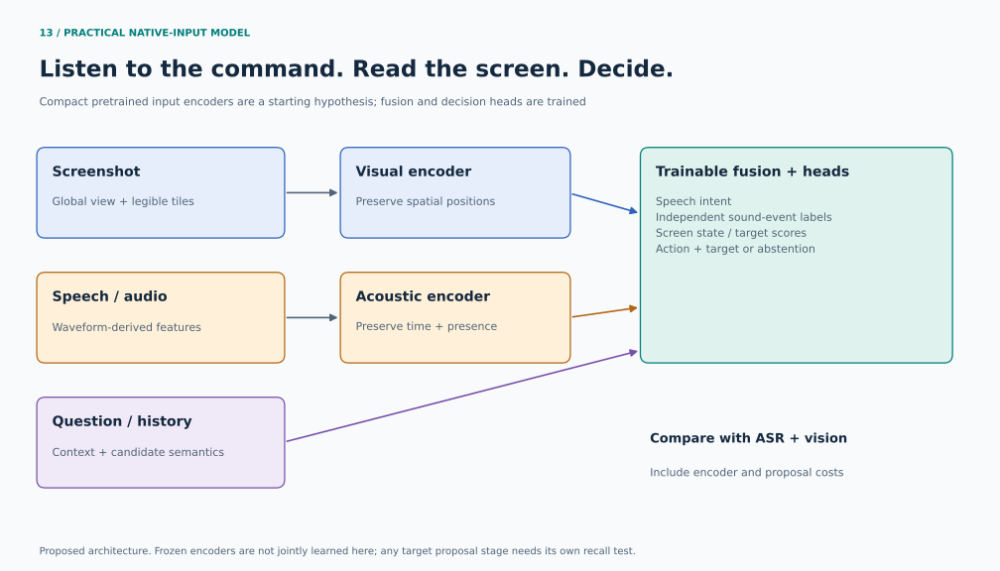

The practical architecture preserves screenshot resolution through global views and tiles/crops; **64×64 is only the toy experiment**. Native audio remains available to the network. ASR-transcript-plus-vision is a comparison baseline, with its whole cost measured. Choosing among supplied UI targets also needs a proposal-recall metric; oracle target boxes do not establish end-to-end grounding.

Keep one scorecard per task family. Multi-label event probabilities need sigmoid/BCE-style treatment; they cannot share an exclusive-choice softmax metric unchanged. For audio latency, report listening duration, endpointing, and processing separately. Full computer-use success is a later execution-based test in a resettable environment, such as [WebArena](https://github.com/web-arena-x/webarena) or a pinned [OSWorld](https://github.com/xlang-ai/OSWorld-V2) release.

## Architecture and alternatives

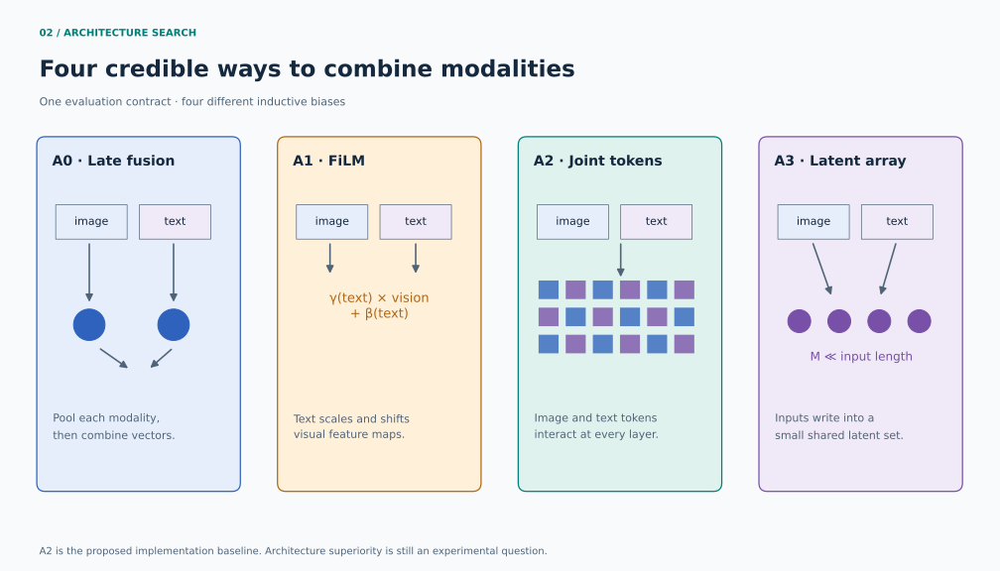

The synthetic control study compares four small models with the same observations, candidate semantics, task mix, and evaluation protocol:

| ID | Design | Why include it | Main concern |
|---|---|---|---|
| A0 | Image encoder + text encoder + pooled late fusion | Cheap control for what coarse features can solve | Pooling may erase spatial relationships |
| A1 | CNN features modulated by a text-conditioned FiLM network | Strong, simple conditioning baseline | Visual inductive bias; recomputation for each question |
| A2 | Image and question tokens in a joint transformer | Transparent baseline for learning cross-modal interactions | Token count and data efficiency |
| A3 | Inputs read into a small latent array, then queried | Decouples input length from the main processing depth | Compression may lose small objects or fine details |

FiLM provides a useful conditional-computation precedent; its own compositional tests also show that strong in-distribution results can coexist with a large generalization gap. ViLT supports the simplicity of patch/text interaction, but its published model uses pretrained initialization: it is not proof that our tiny random-initialized model will learn as efficiently. Perceiver IO motivates A3's input/latent/output separation. [FiLM §2 and §4.5](https://arxiv.org/html/1709.07871), [ViLT §3 and §4.5](https://arxiv.org/html/2102.03334), [Perceiver IO §3](https://arxiv.org/html/2107.14795).

### Proposed A2 synthetic-control baseline

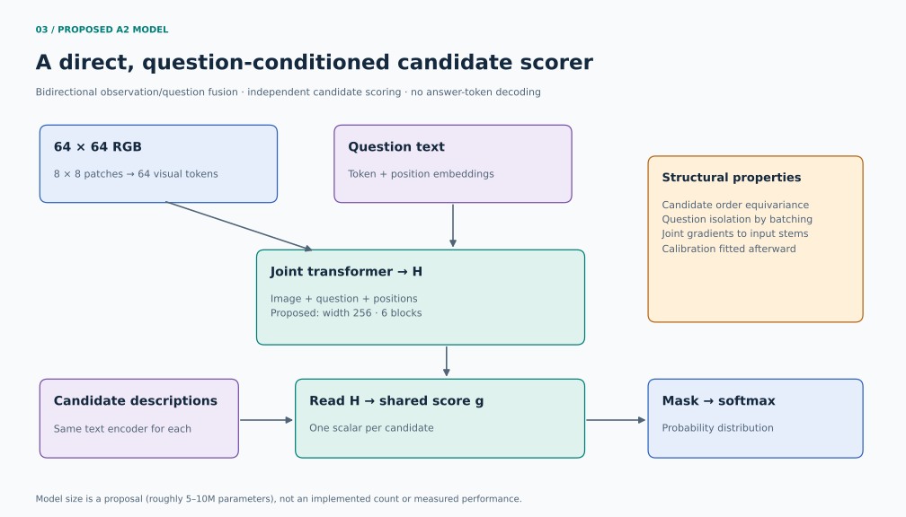

1. Split a `64 × 64` RGB image into `8 × 8` patches: 64 visual tokens.
2. Embed question tokens with a small, training-only vocabulary and position embeddings.
3. Add modality and spatial positions; process image and question tokens together using bidirectional attention.
4. Encode each candidate description with the same small text encoder, independently of its slot in the answer list.
5. Use the candidate embedding to attend to the joint image/question representation; apply the same scalar scoring function to every candidate.
6. Mask padding, then apply softmax across the valid candidate scores. Serialize the numerical result.

In compact notation:

$$
H=F_\theta([P_\theta(x_{image});E_\theta(q)]),\qquad
e_k=E_\theta(c_k),
$$
$$
z_k=g_\theta\!\left(e_k,\operatorname{CrossAttn}_\theta(e_k,H,H)\right),
\qquad p_k=\frac{\exp(z_k/T)}{\sum_{j\in valid}\exp(z_j/T)}.
$$

Use $T=1$ during the initial training baseline. Fit any post-training temperature on a dedicated calibration split after selecting the model.

**Starting configuration, subject to a smoke profile:** width 256, six joint blocks, four attention heads, feedforward width 1024, and two shared text-encoding blocks. Cap questions at 32 tokens and candidates at eight tokens each, with 2–8 options. The expected size is on the order of 5–10 million parameters; the implementation must report the exact count. We should also try smaller widths rather than assume this scale is optimal.

### Candidate order should not become evidence

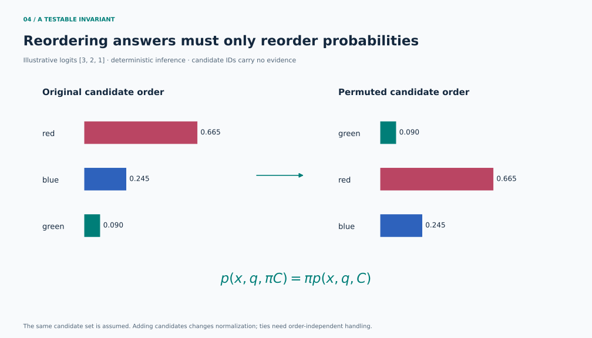

The independent shared scorer gives a structural invariant:

$$
p_\theta(x,q,\pi C)=\pi p_\theta(x,q,C).
$$

This holds at deterministic inference when candidates have no slot embeddings, cross-candidate attention, or order-dependent truncation. Word positions *inside* a candidate remain meaningful. Candidate IDs are output keys; descriptive text supplies semantics. Reject duplicate IDs, duplicate semantic options in the controlled grammar, and questions that refer to opaque option positions. For exact score ties, return the tied set or abstain so the final label does not depend on array order.

Set symmetry is a general design principle [Deep Sets](https://arxiv.org/abs/1703.06114). Textual label conditioning is related to GLiClass, but our isolated scorer deliberately differs from its main joint label/context encoder. [GLiClass §2.1](https://arxiv.org/html/2508.07662).

The invariant is about **permutation of the same candidate set**. Adding an option changes the softmax denominator. Independent scores also impose a restrictive choice structure; relational questions about the candidate set may later require a permutation-equivariant set module.

### Several questions and the cost of perception

The baseline evaluates questions as independent batch items. Parameters are shared; questions do not attend to one another. Because A2 fuses the question into the observation representation, its full representation cannot be reused unchanged across new questions. Only question-independent input work can be cached.

A later challenger can encode observations once and let separate query heads read that state. We must test the quality cost of compressing observations before the question is known. Parallel numerical outputs remove sequential answer-token decoding, but input processing and additional questions still cost compute.

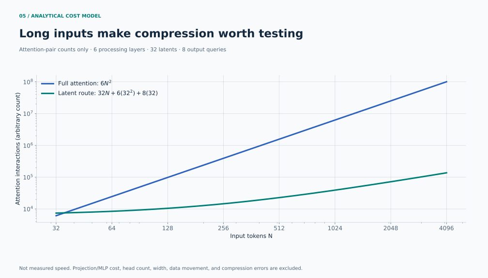

The plot counts attention interactions for a simplified six-layer comparison, with 32 latent tokens and eight output queries. It excludes projections, feedforward work, kernels, batching, and memory traffic. It is **not a latency or FLOP benchmark**. The bottleneck pattern follows the complexity decomposition in [Perceiver IO Appendix E.2](https://arxiv.org/html/2107.14795).

### Which other approaches belong in the study?

| Approach | What it contributes | Position in this project |
|---|---|---|
| Contrastive alignment: CLIP / SigLIP | Reusable image/text representations | Transfer baseline or optional pretraining objective |
| ImageBind | Alignment across more than two modalities | Reference for native audio inputs and missing-pair data |
| BLIP-2 | Small learned bridges over frozen encoders | Reference for Track B |
| GLiClass | Direct predictions conditioned on label text | Reference for dynamic answer spaces |
| VL-JEPA | Predict semantic answer embeddings; score without always decoding text | Important alternative objective after the supervised baseline |
| I-JEPA / LeJEPA | Representation learning and explicit collapse prevention | Optional pretraining study when unlabeled data is useful |
| Chameleon / Transfusion | Joint modeling of mixed modalities | Generative extension if the eventual task needs image or text synthesis |

Sources and limitations for each are in the [reading map](docs/research/reading-map.md). We should not add every loss at once. Similarity learning, generative modeling, probability estimation, and action selection solve different problems. An experiment must identify which capability its added complexity is supposed to improve.

## The probability objective

Start with supervised negative log likelihood (NLL):

$$
\mathcal L_{choice}=-\log p_\theta(y\mid x,q,C),
$$
$$
\mathcal L_{boolean}=-y\log p-(1-y)\log(1-p).
$$

Use a fixed task sampling mixture. Compare Brier loss separately before considering an auxiliary weighted combination. For ordered outcomes, retain the full level distribution; a mean alone hides ambiguity.

Log loss and Brier loss are proper probability objectives: their population optima recover the true conditional distribution under the usual realizability/optimization assumptions. Finite data, misspecification, and distribution shift can still leave a trained network miscalibrated. [Proper scoring rules](https://sites.stat.washington.edu/people/raftery/Research/PDF/Gneiting2007jasa.pdf).

### Why correctness reward is not a probability target

Let the true chance of an event be $q$, and let an agent randomly choose “yes” with probability $p$. Its expected correctness reward is:

$$
R(p)=qp+(1-q)(1-p).
$$

For $q>1/2$, this is maximized at $p=1$, rather than $p=q$. With $q=0.7$, an optimal action policy always choosing “yes” can coexist with the honest belief “70%.” A policy's action probability and an event's probability have different meanings.

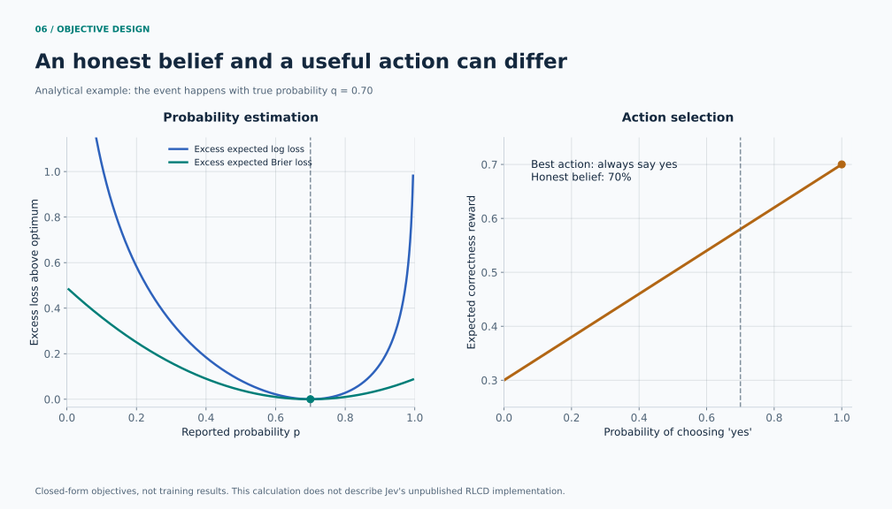

This is our own elementary derivation, not a description of Jev's unpublished algorithm. If labels are directly available, differentiating a proper loss is the simplest baseline. RL becomes relevant for delayed rewards, partial feedback, or interaction-dependent outcomes; the reward still must match the quantity we want to learn. Replacing supervised training with PPO does not itself establish calibration.

The binary illustration uses Brier loss $(p-y)^2$. The experiment ledger uses the sum over all categorical outcomes, which is twice that value for a two-class distribution. The convention changes scale, not the optimum.

### Calibration, uncertainty, and abstention

We will report NLL, Brier score, reliability plots with bin counts, and expected calibration error (ECE) under a declared binning rule. ECE alone can conceal poor discrimination or depend heavily on bins. A model predicting the base rate everywhere can be calibrated and still be unhelpful.

Temperature scaling is a useful low-complexity postprocessing comparison. Fit it on calibration data only; report both raw and adjusted outputs. One temperature is not guaranteed to repair every question family or unfamiliar distribution. [Temperature scaling](https://arxiv.org/html/1706.04599), [uncertainty under shift](https://arxiv.org/abs/1906.02530).

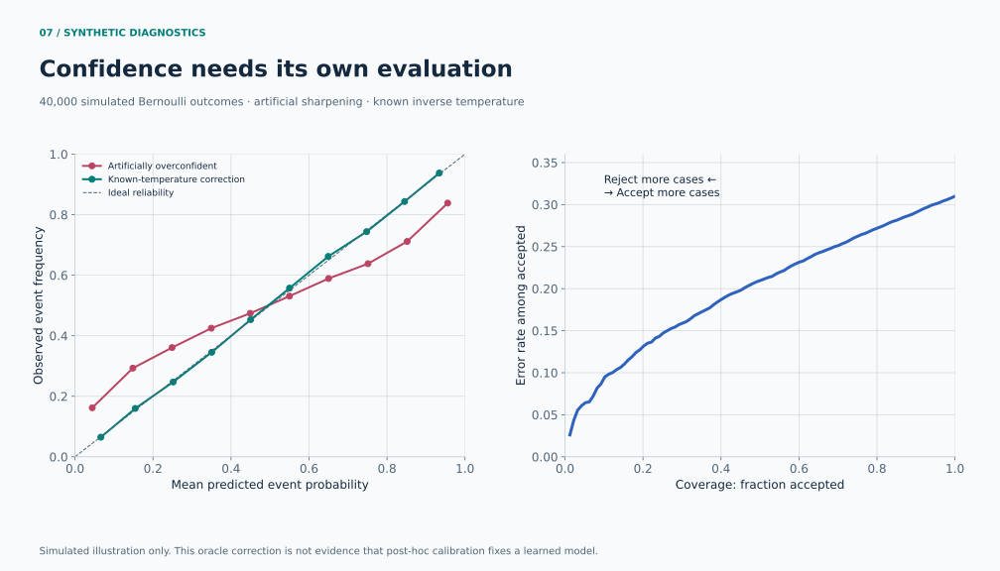

This illustration samples outcomes from a known Bernoulli process, artificially sharpens predictions, and then reverses that sharpening. It explains the diagnostics; it is not evidence for our proposed model. The risk/coverage panel shows the tradeoff as a confidence threshold rejects more cases. Selective classification and conformal prediction offer further tools, with assumptions and guarantees that must be stated precisely. [Selective classification](https://arxiv.org/abs/1705.08500), [conformal prediction tutorial](https://arxiv.org/abs/2107.07511).

For the first proof, use a simple threshold policy and measure the actual error among accepted examples. Missing evidence, unfamiliar inputs, and ambiguous observations require dedicated evaluation. High softmax probability does not certify familiarity.

## Data that requires multiple modalities

The synthetic control dataset will be a deterministic 2D scene generator: colored shapes, positions, and simple occlusions, paired with a small compositional question grammar. All labels come from an independent scene oracle. The model sees rendered pixels and text; scene graphs, seeds, template IDs, and oracle programs stay outside its inputs.

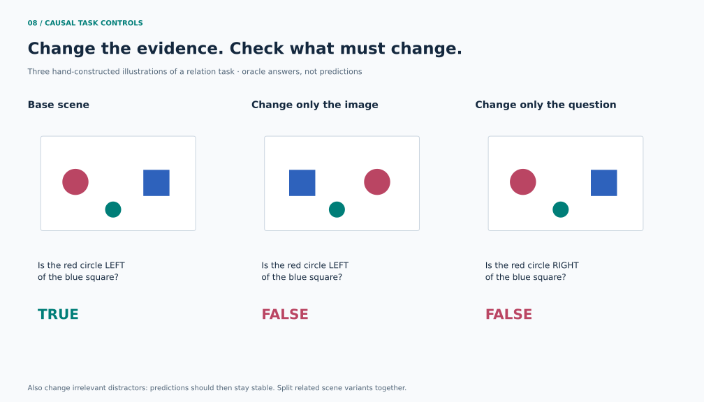

Start with existence, attribute selection, and one-hop spatial relations. Add bounded counting, then noisy or incomplete observations. Long-horizon navigation is a later task because it mixes perception with planning and credit assignment.

Key construction rules:

- **Split by scene family before rendering and question expansion.** Views or paraphrases of the same underlying scene cannot cross splits.
- **Balance labels within question templates.** A text-only baseline should fail on tasks intended to require vision.
- **Use paired interventions.** Change the relevant visual property while holding text fixed; change the question while holding the scene fixed. Include distractor changes that should leave the answer unchanged.
- **Hold out combinations and grammar patterns.** Novel seeds alone do not test compositional generalization. Keep every individual primitive represented in training.
- **Treat observation noise explicitly.** Controlled hidden-state mixtures can supply known conditional event probabilities; arbitrary label corruption and occlusion are not interchangeable.
- **Separate ablations from robust training.** Shuffling a modality diagnoses reliance; a separately trained unimodal control diagnoses information leakage. Missing-modality training requires labels consistent with the information that remains.

CLEVR's diagnostic design and CoGenT splits motivate the controlled stage. Winoground and ARO motivate relation/order counterexamples. Their published results do not transfer automatically to our generated data. [CLEVR](https://cs.stanford.edu/people/jcjohns/clevr/), [Winoground](https://arxiv.org/abs/2204.03162), [ARO §3–4](https://arxiv.org/html/2210.01936).

### Data workstreams

| Workstream | Inputs | Purpose |
|---|---|---|
| Controlled mechanics | Shapes/text, simple real-speech keywords | Verify learnability and expose implementation bugs |
| Speech and sounds | Real recordings with task labels | Separate semantic intent from acoustic-event recognition |
| Screen understanding | Real screenshots and target/state annotations | Preserve small-text evidence and test new app/site layouts |
| Paired decisions | Human utterances/sounds synchronized with screens | Establish cross-modal dependence and useful confidence |
| Workflow integration | Time-aligned observations and executed actions | Measure actual task success in a resettable environment |

These workstreams are defined before model search; audio is not contingent on succeeding at the shapes benchmark. The [audio/screen plan](docs/research/audio-screen-evals.md) is the application contract. [NLVR2](https://lil.nlp.cornell.edu/nlvr/) remains an optional natural-image diagnostic, and [AST](https://arxiv.org/abs/2104.01778) is a reference for spectrogram tokenization.

## Research that improves its own search

There are two different optimization targets: **the multimodal model** and **the research procedure that finds better models**. Improving the first is ordinary automated experimentation. Improving the second requires testing whether a changed procedure finds better solutions under the same budget on tasks it was not tuned to.

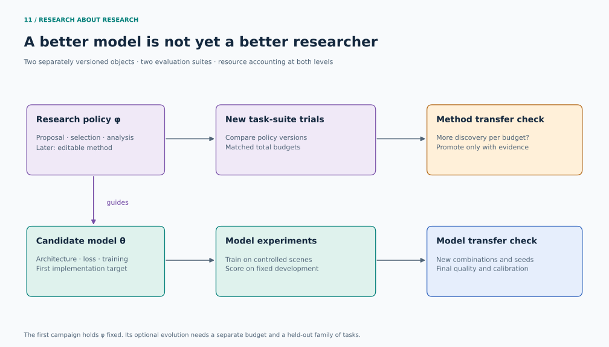

The methodology is a synthesis of current primary research, with small-scale adaptations declared explicitly:

| Source | Evidence and scope | What we adopt |
|---|---|---|
| [AIDE², Sep 22, 2026](https://arxiv.org/abs/2609.26457) | Research-harness rewrites with external-task evaluation; its ignition test is inconclusive | Separate model search from method search; compare research efficiency at equal budgets |
| [AREX, Sep 1 revision](https://arxiv.org/abs/2607.21461) | Research-answer refinement through checks of individual constraints | Maintain verified claims, contradictions, and open questions; perform targeted follow-up searches |
| [RSIAgent, Sep 18 revision](https://arxiv.org/abs/2609.15364) | Environment practice retained as reusable memory, with frozen model weights | Distill evidence from successes and failures; reconcile contradictory lessons |
| [ASI-Evolve, Mar 31](https://arxiv.org/abs/2603.29640) | Automated research over model/data/learning changes | Attach a compact analysis and literature rationale to each experiment |
| [Hyperagents, Mar 19](https://arxiv.org/abs/2603.19461) | Editable task and meta-level agent programs | Version the proposer/selection procedure separately and test transfer before promotion |
| [ShinkaEvolve, maintained through Aug 2026](https://github.com/SakanaAI/ShinkaEvolve) | Executable population-based program search | Retain alternative lineages, detect repeated proposals, and allocate an exploration budget |
| [GEPA](https://arxiv.org/abs/2507.19457) | Reflection-guided prompt optimization | Consider tested changes to research instructions as a later method-level experiment |

These systems are not interchangeable, and some of the papers are very recent preprints. We have inspected methods and source material, not reproduced their reported gains. The [frontier review](docs/research/frontier-methods.md) records dates, reading depth, limitations, and the adoption decision.

**Practical choice:** use an archive-based, evidence-driven experiment process for the proof of concept, with ShinkaEvolve as the preferred runner candidate after a local compatibility check. Keep the initial research policy fixed for comparison. A later meta-study may change that policy, but must use separate task suites and account for both training compute and proposer cost. This avoids confusing a lucky model trial with a better research method.

The [research state](docs/research/research-state.json) already applies claim-by-claim verification to this literature pass. Its unresolved entries remain hypotheses. The [protocol](program.md) specifies how the same discipline will govern future experiments. A bounded baseline trainer and independent scorer now exist. The population/evolution runner is still pending.

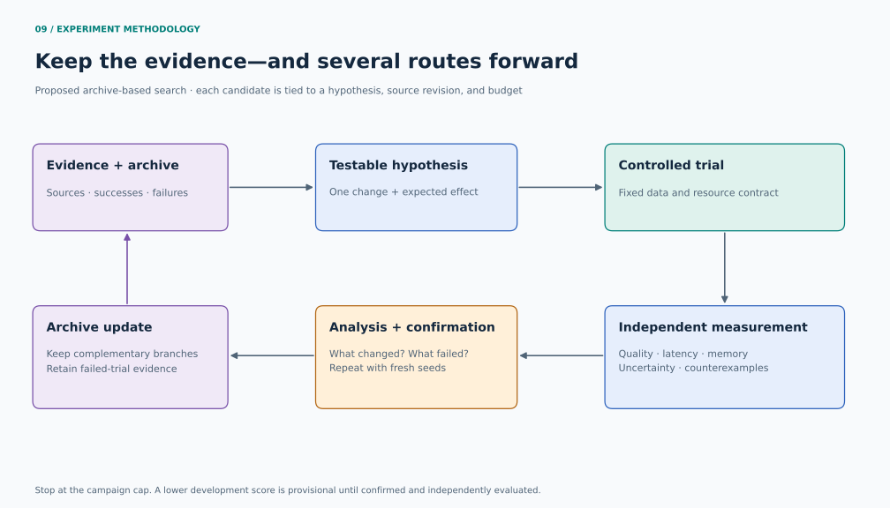

Our planned loop makes the following choices explicit:

| Component | Proposed rule |
|---|---|
| Mutable surface | Model and training configuration; one hypothesis per trial |
| Frozen surface | Data semantics, split manifests, oracle, metric code, and resource accounting |
| Search metric | Macro average of per-task NLL normalized by `log(K)` |
| Screening budget | 300 seconds of synchronized optimizer-loop wall time per run |
| Confirmation | Baseline and nominee, five fresh seeds each, 1,800 seconds per run |
| Constraints | Predeclared latency, memory, correctness, and modality-use checks |
| Recording | Source hash, config, seeds, environment, metrics, durations, and failure status |
| Stop rule | Finite campaign cap and explicit research question; no indefinite execution |

Random uniform predictions have normalized NLL 1 for a fixed exhaustive categorical answer set. Report raw NLL and accuracy alongside the scalar; normalization is for cross-task aggregation, not a claim that every task has equal difficulty. Finalists must also survive slice-level checks so the mean cannot hide a failed modality or task.

The proposed synthetic-control campaign is 12 architecture-screening runs, eight refinement runs, and ten confirmation runs: **6 h 40 min of allocated training time**, excluding setup and evaluation. This is a planned budget, not a runtime estimate or authorization for an unattended run in this research stage. A short profiling pilot must confirm that five-minute screens are informative before freezing this campaign. The optional meta-research campaign has a separate budget and is disabled.

### Keep the final test out of the search

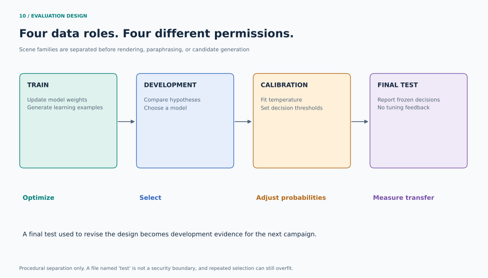

Use separate train, development, calibration, and final-test scene families. The search may repeatedly consult development results. Repeatedly choosing models against a “test” makes it part of development, regardless of its filename. [Adaptive data analysis](https://arxiv.org/abs/1506.02629).

Freeze the candidate and its policy before the final evaluation. If final results trigger design changes, retire that test as development evidence and prepare another untouched test for a later confirmatory claim. This is procedural separation, not an access-control guarantee against an agent that can read the filesystem.

The [synthetic experiment specification](docs/research/experiment-plan.md) defines leakage checks, candidate permutations, multi-question isolation, missing modalities, scene-level uncertainty estimates, and the complete metric ledger. The [campaign manifest](experiments/campaign.json) is marked `planned`, with execution disabled.

## MacBook implementation plan

Use **PyTorch + MPS** for the first implementation, with CPU reference checks and eager execution. This is a portability and debugging choice, not a measured speed ranking. PyTorch documents MPS GPU training; unsupported operations and numerical behavior must be checked on the actual installed version. [MPS documentation](https://docs.pytorch.org/docs/main/notes/mps.html).

**MLX is a credible alternative** for Apple silicon. Benchmark it later against identical data, model semantics, precision, and timing boundaries if profiling identifies a worthwhile port. For historical comparison, the autoresearch-linked [MPS fork](https://github.com/miolini/autoresearch-macos) and [MLX fork](https://github.com/trevin-creator/autoresearch-mlx) are useful implementation references; neither has been executed here. [MLX](https://github.com/ml-explore/mlx).

Practical defaults:

- Start with float32, standard dense attention, AdamW, and short sequences. Verify lower precision before using it in comparisons.
- Profile full input-to-output latency, including preprocessing and synchronization, at batch size one. Also report throughput and multiple-question scaling separately.
- Fix power mode, record OS/framework versions, and randomize trial order where practical. Laptop thermal drift can distort rankings.
- Record process memory, MPS tensor allocation, and driver allocation with their distinct meanings. The 48 GB physical memory pool is shared with macOS; it is not a 48 GB exclusive GPU budget.
- Choose a conservative working budget in the pilot. A proposed 12 GiB process/driver guardrail is a starting operational limit, not an estimate of required memory.

As a rough parameter-state calculation, 10 million parameters with float32 weights, gradients, and two Adam moments occupy about 160 MB in decimal units before activations, temporary buffers, framework overhead, and input data. Sequence lengths and attention can dominate the rest. This estimate is not a measured memory profile.

### Reproduce the documentation

```bash
uv sync --locked --group docs
uv run --locked --group docs python scripts/render_figures.py
uv run --locked python scripts/check_docs.py
```

The figure generator writes SVGs and PNG previews. Sources are original code, with a fixed random seed for the calibration illustration. Its manifest records the formulas, assumptions, and simulated values. No external image generator or copied paper figures are used.

## Evidence and next milestones

| Item | Current status |
|---|---|
| Primary literature and upstream source review | Documented in the reading map |
| Architecture and loss recommendation | Proposed; untested on our task |
| Original explanatory figures | Reproducible documentation artifacts |
| Real-data controls and independent metrics | Implemented; three acquired manifests, categorical/multi-label/grounding/joint scorers |
| Trained checkpoints and measured baselines | Two small audio CNNs plus fixed CLIP screen controls; see report |
| Paired generated-panel data and native fusion | Implemented and evaluated; one selected model, two matched controls, one retained failed development attempt |
| Sentence intent, real paired screens, and workflow success | Pending; the controlled prototype does not establish these |

The next implementation gates are:

1. **Extend application coverage.** Retain the implemented data audits and metrics; populate sentence-intent and paired audio–screen evals. Keep future confirmation samples untouched.
2. **Improve the weak baseline.** The coarse grid is inadequate for small UI targets. Evaluate element proposals or spatial grounding with a fresh confirmation sample, alongside an ASR-plus-vision comparison.
3. **Improve transfer without hiding the failure.** Diagnose command–color shortcuts using the now-exposed composition slice as development, reserve fresh confirmation data, and extend to real paired speech/screens and an ASR cascade comparison.
4. **Publish the actual evidence.** Report all planned slices, calibrated and raw metrics, timings, resource use, counterexamples, and an interactive local demo using a real checkpoint.

The research pass covers the major choices needed for this first proof. It cannot establish an exhaustive optimum across all architectures or guarantee that published large-model gains survive downscaling. The consequential application questions are whether native audio improves decisions over a transcription cascade, whether compact visual processing preserves small UI evidence, and whether probabilities remain useful for unfamiliar speakers and apps. The synthetic study separately compares FiLM, joint tokens, and bottlenecks.

### Repository contents

```text
README.md                         Research narrative and architecture
program.md                        Evidence-driven evolutionary research protocol
docs/research/frontier-methods.md  Current RSI methods and adoption decisions
docs/research/research-state.json  Verified claims and unresolved constraints
docs/research/reading-map.md       Annotated primary sources and reading depth
docs/research/decisions.md         Proposed choices and falsification criteria
docs/research/experiment-plan.md   Synthetic control, budgets, and mechanics checks
docs/research/audio-screen-evals.md  Application data and evaluation contract
docs/research/native-joint-model.md  Implemented joint architecture and API
evals/joint-protocol-v*.json       Frozen paired-model experiments
reports/joint-v2/                  Measured joint-model results
examples/                         Fixed five-question model demo
evals/suites.json                  Planned modality and joint evaluation suites
evals/dataset-catalog.json         Metadata-only public data shortlist
docs/research/autoresearch-source.json  Historical source inspection
docs/research/shinka-source.json   Inspected runner candidate and hashes
docs/assets/                      Original SVG figures and PNG previews
experiments/campaign.json          Disabled, proposed campaign configuration
experiments/results.tsv            Reserved synthetic-search ledger; baseline reports are separate
mmso/                             Data adapters, models, metrics, CLI
artifacts/                        Small trained audio checkpoints and configs
reports/pilot-v1/                  Measured results and plots
evals/README.md                    Reproduction and prediction-format guide
scripts/render_figures.py          Reproducible diagrams and analytical plots
scripts/check_docs.py              Documentation integrity checks
```

Historical reference: [autoresearch](https://github.com/karpathy/autoresearch/tree/228791fb499afffb54b46200aca536f79142f117), inspected at `228791f` (March 26, 2026), remains a simple greedy-loop control. Its CUDA language-model implementation was not run. Repository age alone does not establish methodological inferiority.

Research snapshot: **2026-09-23**. This is an independent project. References to Jev, autoresearch, or other model families identify influences, not affiliation or reproduced results.
