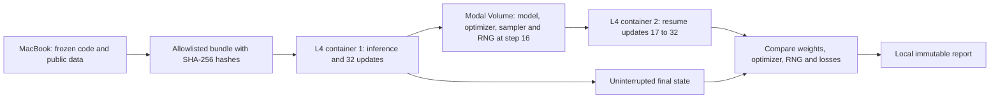

# Modal GPU pilot

This is a bounded infrastructure smoke for the existing `mmso-joint-v3` checkpoint: CPU/CUDA inference agreement, warm batch timings, 32 training updates, and recovery from a step-16 checkpoint in another container. It uses 64 already-exposed **training** scenes. It does not measure new accuracy or nominate new weights.



## Run

```bash
uv sync --locked --group cloud
uv run --locked --group cloud modal token new --profile btoo
# Commit all source changes so the upload names an exact revision.
uv run --locked --group cloud python cloud/prepare_pilot.py
uv run --locked --group cloud modal run --profile btoo cloud/modal_pilot.py --run-id modal-l4-pilot-v1
```

The account must already be authenticated to the intended Modal workspace. Credentials stay in Modal's local configuration, outside the repository. The bundle includes root `mmso/*.py`, the cloud runner, pinned dependency metadata, the v3 checkpoint/config, and the first 64 train scenes from the frozen joint manifest. Every uploaded media hash is checked. Speech is from the public TensorFlow Mini Speech Commands archive (CC BY 4.0); panels are generated by this project. Neither private screenshots nor private recordings are uploaded.

The bundle lives in ignored `.research/modal/bundle`. Archive that directory before preparing another snapshot; use a fresh run ID after an incomplete reference attempt. Checkpoints persist in `mmso-pilot-checkpoints-v1`, isolated by run ID. Completed phases can be retrieved again without rerunning training; a completed local report cannot be overwritten.

## Bounds and interpretation

Two serial calls share a function limited to one L4 container, each with a 180-second function timeout, 120-second startup timeout, no application retries, and a single-use container. The local caller cancels a call after 330 seconds. The pilot has no endpoint, schedule, minimum warm pool, or persistent serving deployment. Containers stop when the run ends; checkpoint storage remains.

At the checked [Modal list prices](https://modal.com/pricing), L4 is $0.000222/second ($0.7992/hour), plus CPU and RAM. We target **under $1** for setup and this pilot. These runtime bounds are not an account billing cap. Verify metered usage afterward; billing may lag, and container allocation/startup time is not captured by the model's internal timer. No claim of zero cost follows from a temporarily zero billing response.

Warm inference timings include prepared-tensor indexing, host/GPU transfers, the model, calibration, output transfer and synchronization. They exclude image/audio decoding, startup and RPC. Report batch-1 latency and batch-32 throughput separately; neither is directly comparable to the existing full HTTP API benchmark.

Training uses a copy of v3, AdamW, 32 updates of 16 questions, and deterministic float32/math-attention settings. Its temporary weights are smoke artifacts, not a replacement for v3. A full tensor-only checkpoint preserves optimizer, sampler and CPU/CUDA random states. The second container compares its final state and losses with the uninterrupted reference. This exercises a clean restart; it does not inject an actual provider preemption. [Modal documents GPU preemption](https://modal.com/docs/guide/preemption), so longer training runs will need periodic durable commits and recovery handling.

General screenshot/audio ability still requires appropriate real-world training and held-out evals. This pilot establishes whether the current training code can run and recover on cloud GPUs.
