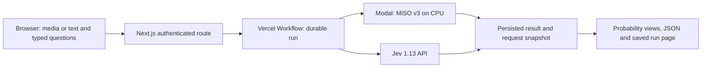

# MiSO playground

The Next.js application in `playground/` uses React Server Components for page composition, model documentation and session-aware rendering. Client components handle media previews, question editing and result inspection. Local Workflow records use `.workflow-data/`, outside Next build output, so a rebuild does not delete them. Each live run starts a Vercel Workflow and receives a stable run URL; the model call runs in a `use step` function with `maxRetries = 0`.



## Local development

Use Node 24 and the repository's locked dependencies:

```bash
cd playground
npm ci
npm run dev -- --port 3047
```

Set these server-side environment variables in `playground/.env.local`:

- `PLAYGROUND_ACCESS_KEY`: owner access key for live runs.
- `SESSION_SECRET`: independent random signing secret for the seven-day HttpOnly owner session.
- `MISO_BACKEND_URL` and `MISO_BACKEND_KEY`: authenticated MiSO API connection.
- `TYPESAFE_API_KEY`: Jev credential.
- `WORKFLOW_LOCAL_BASE_URL=http://127.0.0.1:3047`: local Workflow callback target when using that port.

Credentials are excluded from Git and deployment uploads. The working private configuration is outside the repo under the owner's `.config/miso/` directory. Production/preview secrets are configured in the dedicated Vercel project, never in `NEXT_PUBLIC_*` variables or Workflow inputs. The initial Vercel project uses `playground` as its Git root directory and `iad1` for Workflow locality.

## Supported paths

**MiSO:** one PNG/JPEG and one mono PCM16 WAV up to one second, with Choice, Noul, Score and Ranking views. Each upload is capped at 1 MB in the UI; the request is bounded and schema-validated again on the server. Up to eight named questions are accepted. The model still only understands its recorded keyword set, generated 2×2 panels and limited vocabulary. Arbitrary screenshots and natural speech are not established capabilities.

**Jev:** text state up to 12,000 characters and up to eight Noul, Choice or Score questions. The model is pinned to `jev-1.13.0`. Displayed inference cost uses returned input-token usage and the checked $0.042/M rate; it excludes Vercel hosting/Workflow costs. MiSO CPU serving costs are not estimated per request in the UI.

The page is public to inspect; starting a run or reading a saved run requires an owner session. The native backend independently requires its own bearer credential. Requests and outputs are retained in the private Workflow store. The run-history list stores recent run links in the current browser; it is not an account-wide database. Inputs in a reopened current-version run can be restored from its saved snapshot. The sample voice's source and CC BY 4.0 attribution are in `playground/public/examples/ATTRIBUTION.txt`.

## Serving and deployment

`cloud/modal_playground.py` hosts the existing fingerprinted checkpoints on CPU, with a single container, no minimum warm pool, and a 20-second idle scale-down. Authentication is required for inference. Cold starts can take several seconds. The model-call timer includes the server-to-provider request, including a cold start when it occurs; it excludes browser and Workflow queuing time. It must not be compared directly with the previous warm GPU microbenchmark.

Deploy the backend with `uv run --locked --group cloud modal deploy --profile btoo cloud/modal_playground.py` after creating the dedicated `miso-playground-auth` Modal secret with `MMSO_API_KEY`. No training runs or GPU reservation are started by the playground.

From the repository root, after linking the dedicated Vercel project and configuring its server environment:

```bash
npx vercel --prod --scope btoos-projects
```

The root `.vercelignore` uploads only the playground source and its public fixtures. A workflow run stays attached to the deployment that created it. Code updates must preserve result compatibility. Failed model calls are not automatically retried by the application; provider cost can be unknown after a transport failure. As with durable external calls generally, a worker crash after a remote side effect is not an exactly-once billing guarantee.

## Verification

```bash
cd playground
npm test
npm run typecheck
npm run build
npm audit --omit=dev
```

Also verify through the browser: anonymous live calls rejected, owner unlock, both model paths, saved-run reload, question editing, JSON/download controls and responsive layout. Inspect the actual Workflow status and returned checkpoint/model identity. Build success alone does not establish deployed execution.
