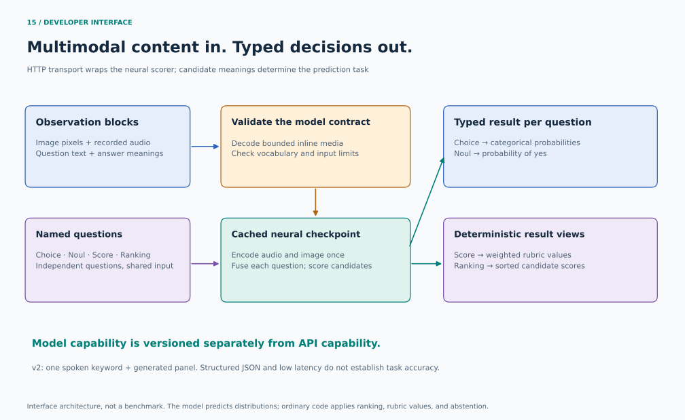

# Developer interface and model contract

The API combines a familiar multimodal content-block interface with direct probabilistic decisions. Image and audio bytes become features inside our model. Question and candidate text enter its learned text encoder. The response is typed JSON created from model probabilities, with no text-generation or JSON-repair stage.

The executable contract and examples live in the [developer API guide](../developer-api.md). This document records the design decisions and their sources, checked on September 24, 2026.

## What the public interfaces contribute

| Reference | Pattern adopted here | Boundary |
|---|---|---|
| [OpenAI image inputs](https://developers.openai.com/api/docs/guides/images-vision) | Typed content blocks carrying text and inline image bytes | Our endpoint and response schema are our own; provider SDK compatibility is not implied. |
| [OpenAI audio inputs](https://developers.openai.com/api/docs/guides/audio-chat-completions) | An audio payload declares its encoding alongside the bytes | This prototype accepts bounded PCM16 WAV clips and produces decisions, with no speech output or streaming conversation. |
| [Claude vision inputs](https://platform.claude.com/docs/en/build-with-claude/vision) | A source object distinguishes base64 content and media type | The current checkpoint requires exactly one image and one audio clip. |
| [Jev typed questions](https://docs.typesafe.ai/api) | Named independent questions, supplied answer descriptions, and a matching structured answer map | We implement the behavioral pattern with our own checkpoint and training method. |
| [TypeSafe confidence](https://docs.typesafe.ai/confidence) | Expose the complete distribution and identify the statistic used for confidence | Our statistic is the maximum adjusted candidate probability. We do not claim the same computation as Jev or an uncertainty detector. |

Here, "multimodal tokens" means media content accepted by the developer interface and encoded into internal neural representations. Callers supply bytes and text. Arbitrary embedding tensors or token IDs would require a separate versioned tokenizer/representation contract.

## One prediction mechanism, four result views

For each observation $x$, question $q$, and supplied candidate descriptions $c_1,\ldots,c_K$, the trained network produces logits $z_k$. The temperature $T$ is fitted on a separate calibration split:

$$p_k = \frac{\exp(z_k/T)}{\sum_j \exp(z_j/T)}.$$

| Output | Computation | Interpretation |
|---|---|---|
| Choice | Highest probability plus the complete distribution | One mutually exclusive answer from the supplied set |
| Noul | $p(\mathrm{yes})$ from the yes/no pair | Probability of the yes answer for a supported question |
| Score | $\sum_k v_kp_k$, using caller-declared finite numeric values $v_k$ | Expected rubric value; an arithmetic view of the categorical prediction |
| Ranking | Sort the candidates by $p_k$ | Relative ordering within this candidate set |

Rubric values and opaque IDs are output metadata. They do not become hidden supervision at inference. The model still sees candidate descriptions. An arbitrary scoring rubric is not made understandable by giving it a numeric value.

These distributions are conditional on the supplied candidates. Adding or removing a candidate changes the normalizer. The model does not infer that the correct answer was omitted. Include all possible answers and an explicit absence class when the task requires it. Ranking probabilities are not independent relevance probabilities, and simultaneous acoustic events need a separately trained multi-label objective.

Named questions are evaluated independently. Observation encodings can be reused, while question-conditioned fusion remains separate. A valid JSON schema establishes output shape; it does not establish correct grounding, speech understanding, calibration under shift, or successful computer actions.

## Model versions and promotion

The API exposes the served checkpoint identity, hash, input contract, vocabulary, and limitations. The initial service uses the previously evaluated `joint-full-v2` checkpoint. New research artifacts keep their own model identity. Changing the API's default model is a separate evidence-based decision after held-out evaluation, latency measurement, and backward-compatibility checks.

The current generated-panel task has a known compositional failure. The new research study compares model size and visual representation structure using a declared development protocol and fresh confirmation data. The existing held-combination test is exposed development evidence from now on. Improving this generated task does not retire the real-screen grounding failure or replace a paired human-speech/browser evaluation.

## Acceptance evidence

The API is checked against the existing checkpoint prediction function, with actual media decoding and HTTP serialization in the path. Rejection tests cover invalid media, unsupported or unused inputs, and invalid question/candidate definitions. Candidate permutations, question isolation, and the distinction between abstention and prediction are structural properties checked independently of model accuracy.

Latency reports identify whether they include JSON serialization, HTTP transport, preprocessing, inference, and synchronization. A response cannot arrive before its one-second recording has been captured merely because loaded inference takes milliseconds. Public hosted service capacity, streaming latency, and long-audio behavior require separate measurements.
