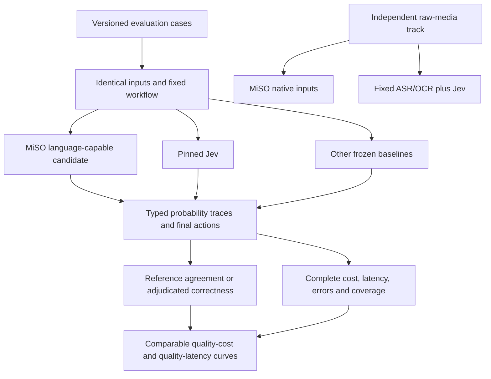
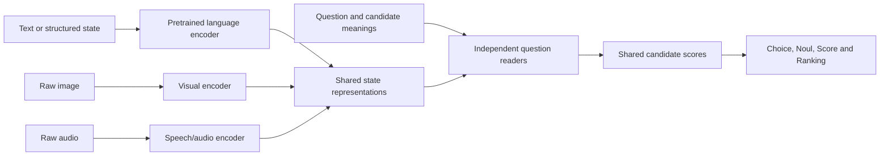

# MiSO versus Jev: a comparable development target

Checked September 24, 2026. **MiSO** is the model/project name; the Python package `mmso` and historical checkpoint IDs remain stable. `miso` is now an additional CLI command, and `/v1/models` includes MiSO display names.

We should develop against Jev on identical inputs and workflows. MiSO has not earned a position on Jev's published frontier: its current 43-token question vocabulary, compulsory image/audio pair and generated-panel task differ fundamentally from the language workflows in that chart. The [actual capability audit](../../reports/miso-jev-readiness-v1/README.md) preserves that failure to qualify instead of assigning a fabricated quality score.

## What the chart measures

TypeSafe reports four workflows: security incidents, agent-trace review, invoices and customer service. Its overview says the reference comes from averaging GPT-6 Astra and Claude Fable 5.1 at high reasoning, with other models at default settings, and gives each workflow equal weight. Thus the plotted quality measures agreement with that reference under a fixed workflow; it does not establish independently verified real-world correctness. [Publisher's evaluation description](https://evals.typesafe.ai/).

The site exposes workflow diagrams, selected cases, questions, state and model answers. The examples are selected to illustrate agreements and disagreements. I did not locate a complete versioned case export, executable harness, reference tensors or exact scoring implementation in the inspected site links or TypeSafe's public repository listing. This is a reproducibility gap, not a claim that those artifacts cannot exist. API access alone does not supply them. [Customer-service examples](https://evals.typesafe.ai/customer_service).

The launch article calls its training method RLCD but does not disclose enough architecture/training detail to reproduce it. Matching its evaluation contract is independent of recovering that proprietary recipe. [Launch article](https://typesafe.ai/blog/introducing-system-one-models-and-jev).

## Three evaluation tracks

| Track | Comparison | What qualifies |
|---|---|---|
| Published Jev workflows | MiSO, pinned Jev and other baselines on the publisher's unchanged tasks | Exact export, workflow, references, scorer and run settings; currently unavailable to this repo |
| Independent text workflows | The same models on our own held-out cases | Human-adjudicated labels and executable checks; family-separated train/dev/calibration/confirmation |
| Native multimodal workflows | MiSO consumes pixels/waveforms; Jev receives a fixed preprocessing pipeline's output | The same source media, with ASR/OCR/vision failures and their full cost/latency counted |

Jev's current documented model is `jev-1.13.0`, accepting text state rather than raw audio or images. Therefore an ASR/OCR-plus-Jev system is a separately identified pipeline. A perfect transcript or scene description is only a diagnostic upper bound. MiSO must also support text-only state to enter the shared language track. [Current model contract](https://docs.typesafe.ai/models).



The diagram is the intended comparison system, not a completed evaluation. The present runner implements only the original engineering smoke described below; it does not execute the publisher's multistage workflows.

## Current implementation

The [live Jev smoke](../../reports/jev-engineering-smoke-v1/README.md) completed 12/12 requests, with 365 ms median client latency and $0.000217686 total inference cost calculated from returned token usage. These fixtures establish integration, not research quality.

`mmso/workflow_benchmark.py` provides a version-pinned Jev HTTP adapter for Noul, Choice and Score, strict validation, a small deterministic routing policy, request hashes, cost/latency recording, and complete case accounting. Wrong schemas, missing answers, nonfinite values and unnormalized probabilities are rejected. Provider confidence is retained separately from the underlying probability vector. No policy action is executed outside the benchmark.

The 12 [original fictional fixtures](../../evals/workflows/smoke-v1.json) exercise three primitives across four domains. Their obvious labels test plumbing. They are not the publisher's dataset, independent human adjudication, a training set or a frontier-quality benchmark. The result is explicitly ineligible for a frontier even if every fixture passes.

```bash
uv run --locked miso --help
# Capability audit: no paid calls, no invented model answers.
uv run --locked python scripts/run_workflow_benchmark.py \
  --provider miso-v3 --run-id my-miso-workflow-audit
# Requires TYPESAFE_API_KEY in the process environment.
uv run --locked python scripts/run_workflow_benchmark.py \
  --provider jev --execute --max-spend-usd 0.10 --run-id my-jev-smoke
# Or pass a private, owner-readable JSON file with an api_key field:
# --key-file ~/.config/miso/typesafe-brian-test.json
```

The adapter makes at most 12 calls, with no automatic retries. It reserves the price of a complete 65,536-token context before each call and stops at the configured spend threshold. The rate is the $0.042/M input tokens published for the pinned version on the checked date; refresh it if pricing changes. Missing usage, uncertain errors or malformed responses stop further calls and leave total cost unknown. Credentials never enter the report. The HTTP contract is checked against the [TypeSafe API](https://docs.typesafe.ai/api); its [MIT-licensed Python SDK](https://github.com/typesafe-ai/typesafe-sdk-python/tree/0ffd094c72ed9445223060b24ffd7a56aa781fb4) and [LLM comparison adapter](https://github.com/typesafe-ai/system-one-adapter-python/tree/e1d4cc938204b22fc5a3c3aca7044072fe3f712d) are pinned references.

## What to measure before claiming progress

Count final workflow outcomes and report a macro average across workflows. Report per-question proper scoring rules (NLL and Brier) separately. Measure calibration and risk versus coverage on appropriately sized held-out sets; a dozen smoke cases cannot establish either. Keep reference-model agreement separate from adjudicated ground truth. Bootstrap paired differences by case family, not by correlated questions.

For cost, count every inference call, retry and preprocessing stage. For self-hosted MiSO, measure allocated serving resources and utilization, not just neural-kernel time multiplied by a GPU rate. Keep training/research spend separate from inference cost, and optionally show how training amortizes at different traffic levels. Record cold and warm client-visible p50/p95, throughput, input lengths, question/candidate counts, concurrency, hardware, client region and errors.

The frontier utility rejects mismatched benchmark, harness, reference, metric, modality, cost accounting, concurrency or latency boundaries. Incomplete coverage and missing costs cannot become frontier points. Use both two-axis views (quality/cost and quality/latency), plus the joint three-objective check. Our existing 3.64 ms warm GPU measurement has a different timing boundary from a Jev network workflow and cannot be placed beside it.

## Model work that can close the capability gap

The next model experiment should replace the tiny learned vocabulary with a compact pretrained language backbone that reads state, questions and candidate meanings. A ModernBERT-style encoder is one candidate to compare, not a claimed winner: the [ModernBERT paper](https://arxiv.org/abs/2412.13663) establishes an efficient encoder approach for classification/retrieval, but does not establish Jev-like instruction following.



This is a proposed successor, not a renamed claim about the existing model. Compare a direct cross-encoder control with reusable state representations plus independent question readers: state reuse may improve throughput but must preserve task accuracy and question isolation. Add missing-modality training so text-only, image/text, audio/text and fully paired inputs are all deliberate supported paths.

For visual and speech representations, [SigLIP 2](https://arxiv.org/abs/2502.14786) and [WavLM](https://arxiv.org/abs/2110.13900) are starting candidates; benchmark relevant alternatives before choosing checkpoint revisions. A practical initial recipe is supervised candidate likelihood plus separately sourced teacher-distribution distillation, then calibration on its own split. [Knowledge distillation](https://arxiv.org/abs/1503.02531) motivates matching soft targets; it does not make teacher answers ground truth. Teacher data must have appropriate training rights. Jev comparison access is not assumed to authorize training on Jev outputs.

Freeze the development harness first. Train on separate licensed examples, retain mismatch/negation/abstention cases, select by development quality and serving cost, then nominate a checkpoint before fresh confirmation. Keep the current small from-scratch native model as a control. A larger GPU or more copies of the same generated panels cannot supply missing language knowledge or realistic screenshot coverage.

The machine-readable [comparison contract](../../evals/jev-comparison-v1.json) records the current readiness gaps and acceptance conditions. No claim of Jev parity, full benchmark reproduction or a new model accuracy gain is made by this integration.
