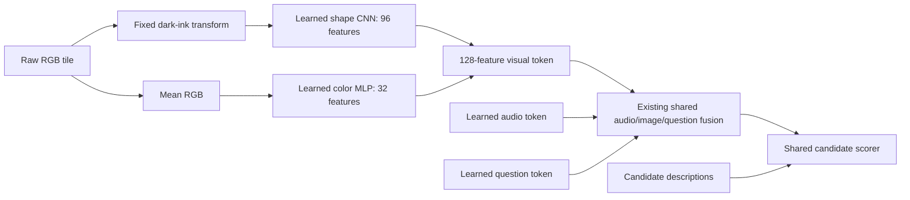

# Scaling versus visual structure

The previous joint model's 45.66% result on held command/color combinations is now exposed evidence. This study asks two separate questions: does a larger shared transformer help, and does a more suitable visual representation help at the original parameter count? It does not re-label the previous test as untouched.

The frozen [protocol](../../evals/scale-protocol-v1.json) compares three conditions: the existing 668,097-parameter architecture; a 1,616,001-parameter model with width 192 and three fusion layers; and a 666,769-parameter model with a factorized visual encoder. The latter two isolate size and a visual prior respectively. Training uses the same 2,048 scenes and audio re-pairing stream, one seed, 8,192 optimizer updates and at most 600 seconds of synchronized training per condition. Attempt budgets and sampled examples are matched; development-selected checkpoints can represent different update counts. FLOPs and elapsed time are not matched. This bounded size study is not a scaling law.

## Why this intervention

[Kapl et al. (2026)](https://arxiv.org/abs/2602.16689) compare dense and object-centric image representations while controlling representation size, data diversity, downstream capacity, and compute. Their finding that structured representations can help under constrained compute motivates testing representation structure before simply expanding our model. Our quadrant tokens are already a strong object-location prior; this experiment narrows the question to separating shape from color inside each token. It does not reproduce their pretrained encoders, slot attention, or benchmark.

[Berga et al. (2020)](https://arxiv.org/abs/2007.06356) use separate shape and color pathways for continual learning. Their task and evidence differ from this experiment. We borrow the architectural idea, not a claim that their result proves compositional generalization here.

The renderer places dark glyphs on colored tiles. Grayscale alone preserves tile luminance, so it does not remove the shortcut. The factorized encoder uses a declared pixel prior: take the maximum RGB channel, map intensities at or below 0.2 to one and at or above 0.4 to zero, with linear interpolation between. In this renderer, the glyph and border remain while all tile fills vanish. A CNN encodes this shape map; a separate MLP encodes spatially averaged RGB. Their outputs occupy different portions of the visual token. Every neural parameter is trainable; the pixel transform itself is fixed. A unit test verifies exact shape-map invariance to the four rendered colors while the separate color representation changes. This is a renderer-specific intervention, not general segmentation.



No scene metadata, glyph labels, transcript, or symbolic oracle enters inference. The independent oracle remains confined to training targets and evaluation labels.

## A fresh confirmation set with an honest boundary

An archive audit found 117 recordings from 80 speakers absent from every previous speech and joint manifest. All are reserved for confirmation. Each recording gets one newly generated ID panel and one new compositional panel, for 117 scenes per slice and 702 primary questions per slice. Existing development and calibration speakers receive new panels, with both ID and compositional slices included. Checkpoint selection minimizes the equal mean of six-family normalized NLL over the two development slices. Temperature calibration uses only calibration rows.

The held word/color tuple identities are the same eight types exposed by the earlier failure and now included in development. This is **same-gap confirmation on fresh speakers and images**, not transfer to previously unexamined types of composition. All held tuples remain absent from training. All three conditions are evaluated once after their checkpoints and development nomination are committed; failures remain in the report. The existing served `joint-full-v2` checkpoint is also evaluated on the identical confirmation rows using its original temperature, so the practical comparison does not mix datasets.

Uncertainty uses paired resampling of speaker clusters. It describes these fixed checkpoints and a small speaker sample, not training-seed variance. Audio is real recorded speech; panels are generated. The real-screen grounding failure is still unresolved.

## Reproduction

From an installed checkout with the existing pinned audio archive:

```sh
uv run python scripts/run_scale_study.py prepare
# Commit the source, protocol, and generated manifests before training.
uv run python scripts/run_scale_study.py train --run-id scale-small-v1
uv run python scripts/run_scale_study.py train --run-id scale-large-v1
uv run python scripts/run_scale_study.py train --run-id scale-factorized-v1
uv run python scripts/run_scale_study.py nominate
# Commit checkpoints and nomination before opening confirmation.
uv run python scripts/run_scale_study.py evaluate --run-id scale-small-v1
uv run python scripts/run_scale_study.py evaluate --run-id scale-large-v1
uv run python scripts/run_scale_study.py evaluate --run-id scale-factorized-v1
uv run python scripts/run_scale_study.py evaluate --run-id joint-full-v2
uv run python scripts/summarize_scale_results.py
uv run python scripts/check_scale_results.py
```

Run IDs and final reports are immutable. Repeating the study requires a new version and fresh run IDs. Existing checkpoints and the serving default remain unchanged.

## Recorded outcome

All three attempts completed their 8,192-update budgets. Neither the 2.42× size increase nor the visual prior established a composition-accuracy improvement over the matched small baseline; both paired speaker intervals include zero. The stricter development objective selected early checkpoints because later training became overconfident under the known composition shift. On identical fresh confirmation rows, the existing served checkpoint retained about a 20-point ID accuracy advantage. The default therefore stays `joint-full-v2`. See the [measured report, complete comparisons and learning curves](../../reports/scale-v1/README.md).

This is evidence to investigate optimization and cross-modal binding before spending more on scale. It is not a general conclusion that bigger models or separated visual features cannot work. One training seed, a fixed optimizer, and generated panels leave those broader questions open.
