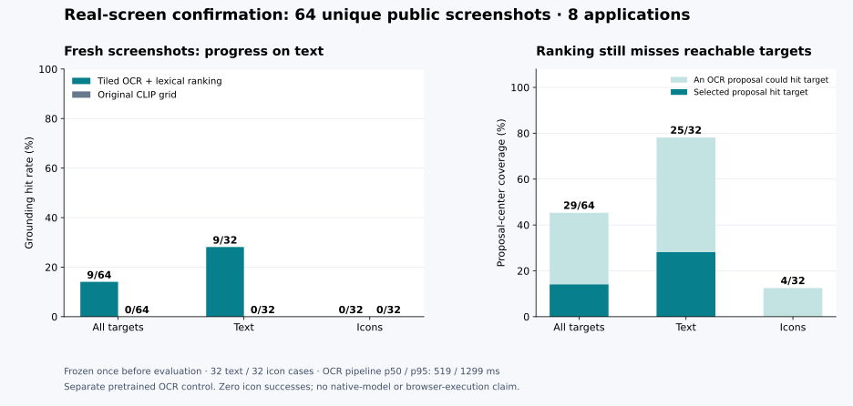

# Real-screen grounding: a broader, fresh confirmation

A local OCR control hits **9/64 targets (14.06%)** on fresh public screenshots, compared with **0/64** for both the original CLIP grid and screen-center controls on those same cases. The improvement is concentrated in text: **9/32 text targets (28.13%)**, with **0/32 icon targets**. This is a separate pretrained Apple Vision OCR pipeline; the native audio/image/question model has its own evaluation.



## What was evaluated

The [frozen confirmation manifest](../../evals/manifests/screen_grounding_v2.jsonl) contains 64 distinct image identities and 64 distinct content hashes from the same pinned [ScreenSpot-Pro source](https://huggingface.co/datasets/likaixin/ScreenSpot-Pro/tree/210e78d3844251110bff86c95835ebd37a6930fa). It includes four text and four icon cases from each of eight applications. Android Studio and Blender had no cases in the earlier development probe. New downloads totaled **225.3 MB**, under the 500 MiB budget.

Every old screenshot filename and content hash was excluded. Selection used a fixed hash of source IDs within application/type quotas, never target geometry, instructions, OCR output, or model predictions. This establishes freshness relative to this project; it makes no claim about images in the upstream OCR or CLIP training data. Related screenshots from the same applications can still share layouts. This balanced subset is not the official full ScreenSpot-Pro benchmark.

The original 24 exposed cases became development data. The legacy failure reproduced exactly: CLIP grid **0/24**, screen center **0/24**, and a grid-center coverage ceiling of **1/24**. Those grid points cannot reach most small interface targets, even if the correct grid tile is identified.

## Algorithm and evidence sequence

The [registered protocol](../../evals/screen-protocol-v2.json) first tested whole-frame OCR. Apple Vision's accurate CPU-only path failed twice on a generated text fixture with `TextRecognition.CRImageReaderError error 1`; the [setup report](../../reports/screens-ocr-setup-v2.json) preserves those failures. Fast recognition, revision 3, succeeded on that fixture. No benchmark OCR evaluation preceded that change.

The OCR engine receives only image pixels. It emits line and word boxes. A fixed lowercase alphanumeric tokenizer, simple plural normalization, and fixed instruction stopword list support two declared lexical rankers: token F1 and within-screen IDF-weighted query coverage. Candidate IDs, UI type, application labels, and target boxes are absent from ranking. Missing lexical evidence causes abstention; every abstention remains in the accuracy denominator. Ties use OCR confidence, fewer tokens, then top/left position.

| Development attempt | Grounding hits | Proposal-center coverage | Abstentions |
|---|---:|---:|---:|
| Original CLIP grid | 0/24 | 1/24 | 0 |
| Whole-frame OCR + token F1 | 1/24 | 5/24 | 11 |
| Whole-frame OCR + IDF coverage | 1/24 | 5/24 | 11 |
| Fixed-tile OCR + token F1 | 3/24 | 9/24 | 3 |
| Fixed-tile OCR + IDF coverage | 3/24 | 9/24 | 3 |

After the weak whole-frame result, one additional development intervention was [registered in protocol v3](../../evals/screen-protocol-v3.json): fixed **1024×1024 pixel tiles with 128-pixel overlap**, covering the full screenshot. OCR boxes are projected back into original pixel coordinates and deduplicated. These crops depend on image dimensions alone; target annotations never select a crop. Synthetic fixtures verify global coordinates across multiple tiles.

Both tiled rankers tied on development hits. The declared tie-break selected **token F1**. The [nomination](../../evals/screen-nomination-v3.json), source hashes, and still-unseen confirmation identities were committed at `50b27244ecf7ee6671006303128c857371f9b83c` before the single fresh evaluation. The prior weak runs remain in the repository. No confirmation failures were used to revise this pipeline.

## Fresh outcomes and remaining gaps

| Method | All 64 | Text 32 | Icons 32 | Proposal-center coverage | Abstentions |
|---|---:|---:|---:|---:|---:|
| Tiled OCR + token F1 | 9 (14.06%) | 9 (28.13%) | 0 | 29/64 | 7/64 |
| Original CLIP grid | 0 | 0 | 0 | 0/64 | 0 |
| Screen center | 0 | 0 | 0 | 0/64 | 0 |

The paired improvement over CLIP is **14.06 percentage points**, with a **6.21–23.44 point** percentile interval from 5,000 paired application-cluster bootstrap draws across eight applications. This interval describes these fixed pipelines on the sampled applications; it does not capture training-seed variance, OCR-version changes, or full-benchmark generalization.

OCR generated some text proposals on every screen, and there were **zero inference errors**. Proposal-center coverage means at least one available OCR box center lands inside the annotated target. It is an upper bound on this proposal set's click accuracy, not an achieved prediction. The text ceiling is **25/32**, while actual text hits are **9/32**: ranking and language interpretation lose 16 text targets that proposals could reach. The icon ceiling is **4/32**, with zero actual hits. A word-overlap ranker does not resolve many paraphrases, icon meanings, or ambiguous repeated labels.

| Application | OCR hits / cases | Proposal-center coverage |
|---|---:|---:|
| Android Studio, absent from development | 0/8 | 2/8 |
| Blender, absent from development | 1/8 | 5/8 |
| Excel | 1/8 | 3/8 |
| macOS common interfaces | 2/8 | 4/8 |
| PowerPoint | 2/8 | 3/8 |
| PyCharm | 0/8 | 4/8 |
| VS Code | 0/8 | 4/8 |
| Word | 3/8 | 4/8 |

The two applications absent from development yield **1/16 hits**. These results support a limited text-grounding improvement and a concrete diagnosis for the next model iteration, while icon grounding and application transfer remain weak.

The 64 confirmation cases are now exposed. Any later selection based on their failures needs a new confirmation partition before making another held-out improvement claim.

## Timing and reproducibility

| Complete inference pipeline | p50 | p95 |
|---|---:|---:|
| Tiled OCR + token F1 | 518.6 ms | 1,299.4 ms |
| Original CLIP grid | 552.5 ms | 795.0 ms |

OCR timings include subprocess startup, image decoding, CPU OCR on every tile, box extraction/projection, serialization, proposal cleanup, and ranking. CLIP timings include image decode, fixed crops, preprocessing, CPU scoring, and selection. Compilation, initial CLIP model setup/warmup, media hash audit, and report writing are excluded. Each case was timed once; other local research could contend for the machine. This is a descriptive complete-pipeline comparison, not an isolated latency optimization benchmark. Center-point timing was not measured; the report's zero timing is an explicit sentinel.

OCR used `VNRecognizeTextRequest`, revision 3, fast English recognition, language correction off, with CPU-only requested. The report records macOS **27.0 build 26A428**, Swift **6.4**, source and executable hashes. Apple supplies OCR weights with the operating system; these weights cannot be independently fingerprinted like our saved checkpoints, so results can drift across OS builds. CLIP's published model revision and weight hash remain pinned.

From a fresh checkout on macOS with Swift command-line tools:

```bash
uv sync --locked
uv run mmso prepare screen_grounding
# The confirmation manifest is checked in. screen_prepare.py deliberately refuses
# to overwrite it; use the acquisition helper below to fetch its exact assets.
uv run python scripts/screen_fetch_manifest.py
uv run python scripts/screen_check.py
uv run python -m unittest discover -s tests -p 'test_grounding_v2.py' -v
```

The experiment runners reject existing run directories. They retain started/partial runs, and OCR failures become explicit abstentions. The independent checker recomputes exact-ID coverage, ranking, proposal ceilings, all outcome slices, timing summaries, the paired interval, and committed source fingerprints from saved artifacts. Reproducing OCR inference requires a new declared run ID/protocol rather than overwriting these results.

Evidence: [legacy reproduction](../../reports/screens-grid-reproduced-v2/report.json), [whole-frame development](../../reports/screens-ocr-development-v2/report.json), [tiled development](../../reports/screens-ocr-development-v3/report.json), [fresh report](../../reports/screens-ocr-confirmation-v3/report.json), [per-case predictions](../../reports/screens-ocr-confirmation-v3/predictions.jsonl), [OCR proposals](../../reports/screens-ocr-confirmation-v3/proposals.jsonl), and [acquisition audit](../../evals/acquisition/screen_grounding_v2.json).

The architecture follows the measured need for smaller image regions, also investigated by the [ScreenSpot-Pro paper](https://arxiv.org/abs/2504.07981). OCR API behavior and coordinate handling use Apple's [text recognition guide](https://developer.apple.com/documentation/vision/recognizing-text-in-images), [range bounding boxes](https://developer.apple.com/documentation/vision/vnrecognizedtext/boundingbox(for:)), and [CPU execution option](https://developer.apple.com/documentation/vision/vnrequest/usescpuonly). The learned native model can eventually be evaluated against this control on the same kind of real observations; these OCR scores do not establish its browser capability.
