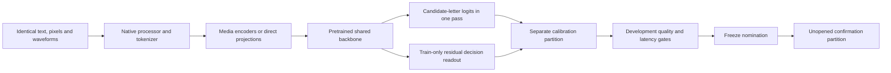

# MiSO v4: selecting a backbone with measured evidence

**Completed September 25, 2026:** [results and figures](../../reports/v4-selection-v1/README.md). MiniCPM-o 4.5 is the provisional research lead; Qwen3-Omni is the quality reference. Neither cleared every quality gate, and both scored 39.58% on confirmation screen localization. The public playground was not changed.

The selection target is the fastest native text/image/audio decision model that passes explicit quality gates on the same hardware. Gemma is a candidate, not a default winner. This study investigates a successor to the 668,097-parameter v3 control; it does not promote a new playground model or establish Jev/OpenAI parity.

The [frozen protocol](../../evals/v4-selection-protocol-v1.json), [pinned candidate inventory](../../evals/v4-candidates-v1.json), and [dataset acquisition audit](../../evals/acquisition/v4_selection_v1.json) are the executable record. The protocol was committed before candidate inference. Results and failed attempts are retained under `reports/v4-selection-v1`.



## What is being compared

Eight ungated checkpoints span Gemma 4 E2B/E4B/12B, Qwen2.5-Omni 3B/7B, Qwen3-Omni 30B-A3B, MiniCPM-o 4.5, and Phi-4-multimodal. Gemma 3n E2B is recorded as access-blocked, not as a performance loser. The 3B Qwen2.5 checkpoint is a research-only control because of its publisher's license. Model IDs, immutable revisions, total stored parameters, source fingerprints and eligibility are in the inventory.

The families make different tradeoffs. Gemma 4's smaller variants use modality encoders and per-layer embeddings, while its 12B Unified model directly projects media into the shared backbone. MiniCPM-o combines pretrained visual, audio and language components; Qwen3-Omni uses a mixture-of-experts language backbone. Active parameters and hidden width cannot substitute for actual memory or latency measurements. [Gemma architecture](https://ai.google.dev/gemma/docs/core/model_card_4), [MiniCPM-o report](https://arxiv.org/abs/2604.27393), [Qwen3-Omni report](https://arxiv.org/abs/2509.17765).

All candidates receive the same source information and BF16 H100 hardware. Raw audio is never replaced with its reference transcript. Screen annotations determine labels only; models see the screenshot and instruction. Model-specific native processors can produce different numbers of tokens, which are recorded as part of the comparison. This evaluates complete supported inference pipelines, not an isolated tokenizer speed contest. Runtime or attention-backend differences must be disclosed.

The completed study required the publisher-compatible Transformers 4.51/PyTorch 2.8 runtime for MiniCPM and Phi, while the other candidates used Transformers 5.17/PyTorch 2.14. Failed compatibility attempts were retained. The [bounded adapter follow-up](../../evals/v4-adapter-protocol-v1.json) and its [candidate nomination](../../evals/v4-adapter-nomination-v1.json) were committed before training. Final adapters, readouts and temperatures were then frozen in the [confirmation nomination](../../evals/v4-nomination-v1.json).

## Quality coverage and its limits

| Track | Question being tested | Material limitation |
|---|---|---|
| Text rules | Follow explicit business rules and precedence | Original synthetic controls, not broad language intelligence |
| Spoken intent | Classify natural human sentences from SLURP | Eight English intents; utterance-disjoint, not a proved speaker-disjoint corpus |
| Sound events | Recognize ten environmental sound classes | ESC-10 subset; no overlapping-event guarantee |
| Screen region | Locate a requested UI element in a real screenshot | Nine coarse regions, not exact clicking or browser task completion |
| Joint control | Combine a spoken word with a colored visual panel | Natural speech with generated images and a bounded vocabulary |

The 1,232 cases are split into 496 training, 152 calibration, 264 development and 320 confirmation cases. Exact media hashes and group identities cannot cross partitions. Existing public benchmarks may have appeared in upstream pretraining; this study cannot prove otherwise. Quality floors are preregistered engineering criteria, not customer acceptance.

SLURP's original publisher licenses textual material under CC BY 4.0 and audio under CC BY-NC 4.0. Consequently this is a noncommercial research/evaluation dataset, and any fitted study readouts must not be silently promoted into a commercial service. Selecting an independently licensed base checkpoint is separate from authorizing the data used to train a production derivative. [SLURP source and licenses](https://github.com/pswietojanski/slurp#license), [ESC source](https://github.com/karolpiczak/ESC-50), [ScreenSpot-Pro source](https://huggingface.co/datasets/likaixin/ScreenSpot-Pro).

## Decision heads, speed and calibration

The primary baseline computes all supplied option scores from one forward pass. It does not ask an LLM to write probabilities as JSON. A residual linear readout is additionally trained on frozen hidden states using training data only, with its temperature fitted on the separate calibration partition. Development chooses among these variants. This is an economical adaptation screen; it does not establish the result of full LoRA tuning, multimodal distillation or shared-state multi-question readers.

A model must pass every modality floor and the macro floor; calibrated proper scores must beat uniform guessing. Runtime failures remain in the accuracy denominator. Among qualifying models within three percentage points of the highest development accuracy, the objective is the lowest equal-track mean of p95 request latency. Point-estimate proximity is not proof of statistical equivalence; paired group intervals and fresh confirmation must accompany any nomination. If no model qualifies, the study reports that fact instead of choosing a fake winner.

Timing separates file decode, plain text-tokenizer probes, native processor, transfers, model forward, instrumented media encoders and decision scoring. Model loading, warmup, RPC and research feature copies are separate. A generated-output control is a further diagnostic, not the baseline used to inflate speedups. [Prefill and decoding costs](https://modal.com/docs/guide/high-performance-llm-inference).

## Compute and reproduction

The study uses one H100 at a time, no public endpoint, no automatic application retries, a one-hour GPU call timeout and at most 24 GPU jobs. Each job reserves a conservative allocation proxy before dispatch. The intended study ceiling is $250; this local accounting is not a platform-enforced billing cap. Downloads run on CPU and checkpoints stay on a dedicated Modal Volume. Actual billing can lag measured allocation. [Modal rates](https://modal.com/pricing).

```bash
uv sync --locked --group cloud --group research --group dev --group docs
uv run --locked --group research python scripts/fetch_v4_data.py
uv run --locked --group research python scripts/prepare_v4_study.py
uv run --locked python scripts/prepare_v4_bundle.py
uv run --locked --group cloud modal run --profile btoo cloud/modal_v4_study.py \
  --phase download-all --attempt downloads-v1
uv run --locked --group cloud modal run --profile btoo cloud/modal_v4_study.py \
  --key gemma4-e2b --phase smoke --attempt gemma4-e2b-smoke-v1
```

Use fresh attempt IDs. The restore script acquires the pinned natural-data sources and verifies the exact frozen media; procedural panel PNGs are checked in to avoid platform font drift. Other raw media, model caches and extracted features remain outside Git. Confirmed model changes require their own versioned artifacts and API verification.
