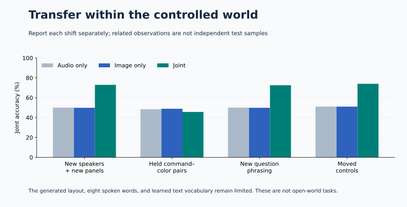

# First unified multimodal decision model

A single neural model now reads recorded audio, image pixels, question text, and candidate descriptions. One shared scoring head returns probabilities over the supplied answers. All encoders and fusion/scoring layers are jointly trained; the acoustic representation was warm-started from our earlier small speech model, with its fixed output head removed.


| Held-out slice | Joint model | Audio-only control | Image-only control | Joint questions |
|---|---:|---:|---:|---:|
| New speakers + new panels | 72.92% | 50.00% | 49.83% | 1152 |
| Held command– color pairs | 45.66% | 48.44% | 48.87% | 1152 |
| New question phrasing | 72.57% | 50.00% | 49.83% | 1152 |
| Moved controls | 73.96% | 51.04% | 51.04% | 576 |

The score averages six question families: color/position of the spoken command or its opposite, and presence/absence. Audio-word and tile-word auxiliary tasks are excluded. Evaluation speakers were never used in any earlier baseline partition.

**The held-composition test fails:** accuracy falls to 45.66%, below the unimodal controls. The model uses both inputs on familiar combinations but does not yet separate command identity from color robustly. Further work must treat this exposed slice as development evidence and use a fresh confirmation set.



## What the comparison establishes

- Joint minus joint-audio-only-v2: **22.9 percentage points**, paired speaker-cluster interval **[18.0, 27.7]** on in-distribution held-out questions.
- Joint minus joint-image-only-v2: **23.1 percentage points**, paired speaker-cluster interval **[18.2, 27.9]** on in-distribution held-out questions.

These intervals condition on one set of trained checkpoints. They do not estimate variability across training seeds, and they do not establish general browser capability. Related question and intervention variants share observations; counts must not be read as independent recordings.

## Candidate and question behavior

Candidate permutation changed logits by at most **0**. Answering the first question alone versus in the batch changed logits by at most **1.91e-06**. IDs are ignored by the neural encoder. Candidate-subset checks use 2–4 options without retraining; they are easier-choice structural diagnostics, not tests of unseen vocabulary.

| Same observations, different questions | Pairs requiring different answers | Both answered correctly |
|---|---:|---:|
| color_vs_opposite_color | 137 | 41.61% |
| position_vs_opposite_position | 154 | 41.56% |
| present_vs_absent | 192 | 69.79% |

## Why the first attempt was retained

Fixed one-to-one recording/panel pairs overfit. The second attempt changed only training pairing: draw a word and one of its recordings independently of the panel, then recompute the supervised answer. This breaks both recording→panel and panel→spoken-word memorization. Architecture and optimizer stayed fixed; the first development run remains in the repository. Selection and nomination used development data before final metrics were opened.

## Performance scope

The model has **668,097 parameters**. Its measured loaded-model pipeline p95 is **9.84 ms** across 32 examples, including file decoding, preprocessing, question/candidate encoding, fusion, scoring, and device synchronization. Listening duration and checkpoint loading are excluded. This is offline one-second speech, not streaming latency.

The visuals are generated 2×2 symbol panels, not real application screenshots. Speech is eight isolated keywords. The learned text vocabulary has 43 tokens including special tokens. All candidate concepts and question families occur in training; held-out compositions and wording test limited recombination. This independently designed supervised model does not reproduce Jev’s unpublished RLCD or establish arbitrary instruction following.

Temperature scaling was fitted on separate calibration data. Raw and adjusted NLL, Brier, reliability bins, and per-task accuracy are in the full evaluation files; an accuracy result alone does not establish calibration under shift.

## Evidence and reproduction

- [Architecture and interface](../../docs/research/native-joint-model.md)
- [Initial protocol](../../evals/joint-protocol-v1.json) and [re-pairing follow-up](../../evals/joint-protocol-v2.json)
- [Pre-test nomination](../../evals/joint-nomination-v2.json)
- [Full evaluation](../joint-full-v2/evaluation.json) and [complete predictions](../joint-full-v2/predictions.jsonl)
- [Audio-only evaluation](../joint-audio-only-v2/evaluation.json)
- [Image-only evaluation](../joint-image-only-v2/evaluation.json)
- [First attempt, development only](../joint-full-v1/training.json)
- [Checkpoint](../../artifacts/joint-full-v2/model.safetensors) and [config](../../artifacts/joint-full-v2/config.json)

```bash
uv run --locked mmso prepare speech_keywords
uv run --locked mmso joint-prepare
uv run --locked python scripts/run_joint_demo.py
uv run --locked python scripts/check_joint_results.py
```

The demo uses the first in-distribution test scene, chosen before held-out evaluation. Its five questions are supplied through the public prediction function. The symbolic oracle is not called by that function.
