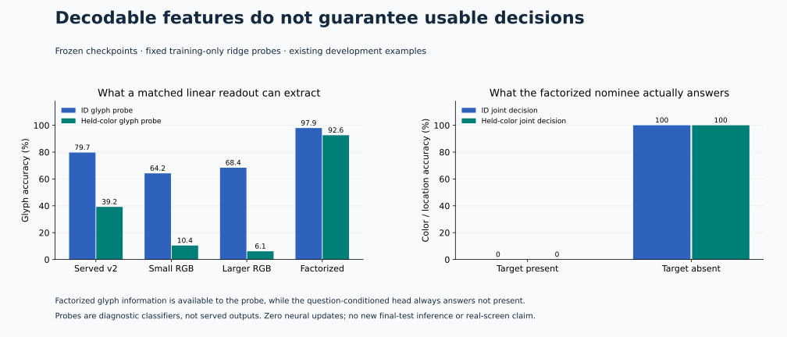

# Optimization diagnosis

**The factorized encoder contains decodable glyph identity, but its selected joint head does not use it.** A matched linear probe scores 92.58% on held-color glyphs while the actual candidate scorer always answers “not present” on color/position questions. This distinguishes feature information from usable cross-modal binding.



## Matched frozen-representation probes

Each checkpoint receives the same fixed ridge procedure: 256 training panels, 1,024 glyphs, 256 recordings, training-only feature standardization, ridge strength 1 and an unpenalized intercept. Evaluation uses the same scale-v1 development rows for every checkpoint. There are 12 temporary closed-form classifier fits, zero neural optimizer updates, and no saved readout weights.

| Checkpoint | Glyph ID | Glyph composition | Color ID / composition | Audio word |
|---|---:|---:|---:|---:|
| Served v2 | 79.69% | 39.19% | 100.00% / 100.00% | 83.33% |
| Small RGB | 64.19% | 10.42% | 100.00% / 100.00% | 80.73% |
| Larger RGB | 68.36% | 6.12% | 100.00% / 100.00% | 81.77% |
| Factorized | 97.92% | 92.58% | 100.00% / 100.00% | 80.21% |

Audio inputs are identical across the two development image slices. Probe feature width follows each model: 128 except the larger model's 192. These are trained diagnostic readouts on exposed development data, not a replacement for the learned question/candidate head or independent confirmation.

## The absence shortcut in saved decision predictions

| Checkpoint / native dev slice | Predict not present | Present-target accuracy | Absent-target accuracy | Heard-word question | Tile-word question |
|---|---:|---:|---:|---:|---:|
| joint-full-v2 / in_distribution | 62.76% | 53.46% | 88.01% | 87.50% | 63.54% |
| scale-small-v1 / in_distribution | 100.00% | 0.00% | 100.00% | 70.31% | 7.81% |
| scale-small-v1 / compositional | 100.00% | 0.00% | 100.00% | 71.88% | 11.98% |
| scale-large-v1 / in_distribution | 99.48% | 0.72% | 99.72% | 82.81% | 13.02% |
| scale-large-v1 / compositional | 100.00% | 0.00% | 100.00% | 82.29% | 9.38% |
| scale-factorized-v1 / in_distribution | 100.00% | 0.00% | 100.00% | 82.81% | 8.33% |
| scale-factorized-v1 / compositional | 100.00% | 0.00% | 100.00% | 82.29% | 17.19% |

This table recomputes each run's saved native development predictions. The served-v2 row uses its older development panels; the three scale rows share scale-v1 panels. The linear-probe table above instead scores all checkpoints on the same scale-v1 panels. The existing tile-word question also tests location routing and text/scorer behavior, so its failure is not a pure perception diagnosis.

## Checkpoint-selection history

The prior scale selector used raw normalized NLL. Temperature scaling was fitted afterward. Factorized epoch 32 reached 71.61% ID and 50.87% composition accuracy, but composition normalized NLL deteriorated to 2.0368, so epoch 2 was retained. Later weights/logits were not saved. We cannot reconstruct a calibrated late-checkpoint result. A positive temperature never changes argmax accuracy.

## CPU gradient snapshots

A deterministic re-paired batch uses the first 32 training scenes: 256 requests, comprising 192 joint, 32 heard-word and 32 tile-word losses. Gradients are computed on CPU with two threads and no optimizer step. The checkpoint parameters are compared before/after to verify they remain unchanged. The report includes L2, RMS and parameter-relative norms, and joint/auxiliary cosine similarity per branch.

For the selected small model, image-branch joint/tile-word gradient cosine is -0.332; for the served model it is +0.726. Existing tile-word supervision also sends gradients through audio although the target is visually determined. These are single-batch observations, not causal evidence that gradient imbalance caused training failure. Different parameterizations and loss scales affect the norms.

## Reproduce and inspect

- [Primary-source review and falsification plan](../../docs/research/optimization-review.md)
- [Saved-prediction diagnosis, gradient snapshots and source hashes](report.json)
- [Matched frozen readouts and their source/input hashes](primitive-probes.json)

```sh
# Recompute saved metrics and frozen readouts without overwriting archived evidence.
uv run python scripts/check_optimization_diagnosis.py --recompute-probes
uv run python scripts/probe_primitive_representations.py --output .research/repeated-primitive-probes.json
uv run --group docs python scripts/render_optimization_diagnosis.py
```

The diagnostics load versioned manifests and select train/dev records for computation; this is not a sandbox that hides other manifest rows. They perform no new calibration/final inference. The generated-panel setting and previously known composition gap remain explicit limitations.
