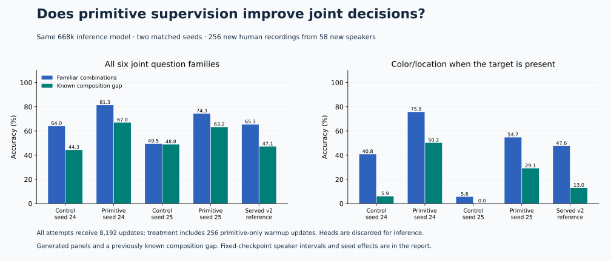
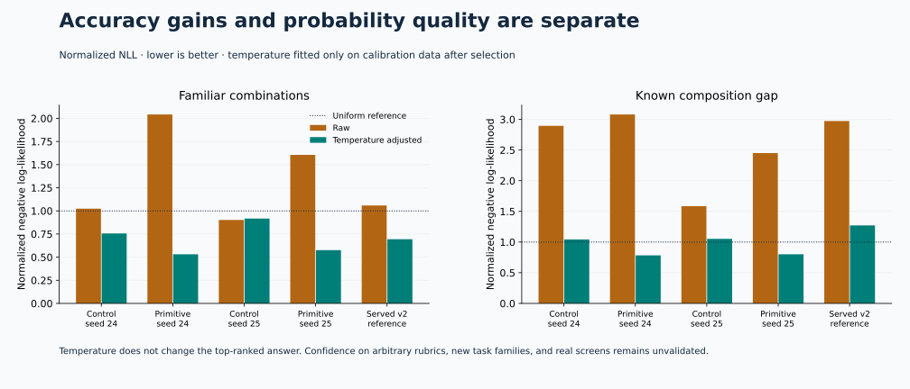

# Primitive-supervision optimization study

The primitive-supervision candidate passed the predeclared accuracy gates and is available explicitly as `mmso-joint-v3` after CPU/MPS HTTP parity checks. V2 remains the compatibility default. The [API report](../api-comparison-v3/README.md) preserves substantial latency variation; no stable latency SLA is established.



| Checkpoint | Budget updates | Selected updates | Training seconds | Familiar accuracy | Composition accuracy | Temperature |
|---|---:|---:|---:|---:|---:|---:|
| Control, seed 24 | 8,192 | 8,192 | 410.9 | 64.00% | 44.34% | 5.930 |
| Primitive supervision, seed 24 | 8,192 | 7,168 | 409.9 | 81.32% | 66.99% | 5.187 |
| Control, seed 25 | 8,192 | 5,888 | 398.9 | 49.48% | 48.83% | 5.372 |
| Primitive supervision, seed 25 | 8,192 | 6,400 | 409.5 | 74.35% | 63.22% | 4.583 |
| Served v2 reference | 8,822 | 8,448 | Earlier study | 65.30% | 47.14% | 3.148 |

Both recipes retain the original 668,097-parameter inference architecture. The treatment uses 1,548 temporary training parameters, direct glyph/color/audio-word supervision, and a shared concept classifier. Its 256 warmup updates are included in the common budget. This compares a defined recipe, not each of its components in isolation; FLOPs and elapsed time differ.

The same accuracy gate/selection rule applies to both new conditions. It differs from the previous scale study's raw-loss-only rule. The served-v2 checkpoint is an operational reference with a different historical budget and selection process, not the matched causal control.

## Repeated-seed effects

| Seed | Treatment minus control, mean familiar/composition accuracy |
|---|---:|
| 20260924 | +19.99 percentage points |
| 20260925 | +19.63 percentage points |

Both seed outcomes are retained. Two seeds are a replication check; they do not precisely estimate training-seed variance.

## Paired confirmation differences

| Candidate | Reference | Slice | Difference | Speaker-cluster 95% interval |
|---|---|---|---:|---:|
| optimization-primitive-s24-v1 | optimization-control-s24-v1 | in_distribution | +17.32 pp | [+13.23, +21.24] pp |
| optimization-primitive-s24-v1 | optimization-control-s24-v1 | compositional | +22.66 pp | [+17.21, +28.18] pp |
| optimization-primitive-s24-v1 | optimization-served-reference-v1 | in_distribution | +16.02 pp | [+11.95, +20.32] pp |
| optimization-primitive-s24-v1 | optimization-served-reference-v1 | compositional | +19.86 pp | [+14.59, +25.26] pp |
| optimization-primitive-s25-v1 | optimization-control-s25-v1 | in_distribution | +24.87 pp | [+20.28, +29.28] pp |
| optimization-primitive-s25-v1 | optimization-control-s25-v1 | compositional | +14.39 pp | [+11.31, +17.52] pp |
| optimization-primitive-s25-v1 | optimization-served-reference-v1 | in_distribution | +9.05 pp | [+4.30, +13.85] pp |
| optimization-primitive-s25-v1 | optimization-served-reference-v1 | compositional | +16.08 pp | [+11.92, +20.27] pp |

Intervals use 2,000 paired speaker-cluster resamples over 58 speakers. They condition on the trained checkpoints, are not simultaneous multiple-comparison guarantees, and do not measure variation over future training runs.

## Probability quality



Complete raw and temperature-adjusted NLL, Brier, reliability bins, and task results remain in each evaluation file. Higher accuracy can coexist with highly overconfident errors. Calibration uses only the separate calibration rows; it does not establish confidence reliability on a new distribution.

## Shortcut and data checks

The right-hand accuracy panel evaluates only color/location questions whose target actually exists. Predicting absence cannot pass this slice. The summary also retains absent-target accuracy and the rate of predicting `not present`, for development and confirmation separately.

Confirmation contains 256 balanced keyword recordings from 58 speakers absent from all prior manifests, paired with 512 newly generated panels. Each primary slice has 1,536 related questions. Speaker grouping is used for uncertainty. The source is the official Speech Commands v0.02 test archive; this filtered custom task is not its official benchmark.

Held word/color identities are the same previously exposed gap types used in development. Voice and image assets are fresh. This does not establish novel-gap, sentence-intent, real-screen, or browser-execution generalization.

A numerical tie edge was corrected between seeds before confirmation: exact correct-count fractions now determine accuracy ties. Both completed seed-24 winners were checked and unchanged. The [precision audit](selection-precision-audit.json) and original source revisions are retained.

## Gates and evidence

Pre-test development nominee: `optimization-primitive-s24-v1`.

| Gate | Passed |
|---|---|
| both treatment runs complete | True |
| both development gates pass | True |
| balanced accuracy gain in both seeds | True |
| candidate composition interval positive vs served | True |
| candidate id loss no more than two points vs served | True |

- [Training design and reproduction](../../docs/research/primitive-supervision.md)
- [Frozen protocol](../../evals/optimization-protocol-v1.json) and [nomination](../../evals/optimization-nomination-v1.json)
- [Data audit](../../evals/acquisition/optimization_panels_v1.json) and [all comparisons/shortcut slices](summary.json)

```bash
uv run python scripts/check_optimization_results.py
uv run --group docs python scripts/render_optimization_results.py
```
