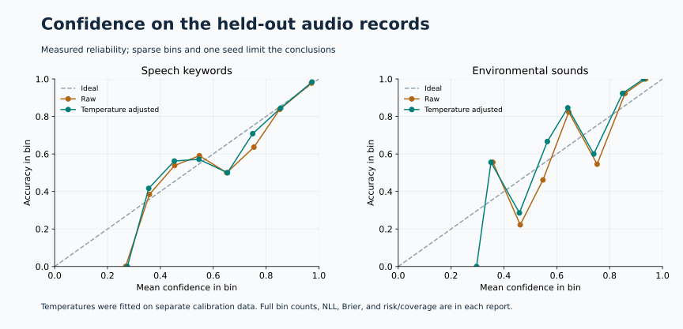

# First measured real-data baselines

These are implementation controls on small, pinned subsets. They are not an architecture search, official benchmark submission, or proof of native audio–screen reasoning.

| Task | Held-out records | Accuracy | Class-prior accuracy | Raw → adjusted NLL | Warm p95 processing |
|---|---:|---:|---:|---:|---:|
| Eight spoken keywords | 256 | 81.25% | 12.50% | 0.686 → 0.677 | 2.09 ms |
| Ten environmental sounds | 80 | 66.25% | 10.00% | 1.207 → 1.187 | 4.65 ms |

Speech uses 89,640 parameters; sound uses 89,770. Both were trained from scratch on MPS. The fixed recipe allowed at most 16 epochs / 120 synchronized training seconds per dataset; both reached the epoch limit first. The best development-NLL checkpoint was frozen before calibration and test evaluation.

The speech split is speaker-disjoint. Sound preserves source-recording fold groups with a custom train/development/calibration/test assignment. Each report includes source and manifest hashes, checkpoint hashes, parameter counts, per-class results, all development epochs, and memory measurements.

Audio timing includes warm file decoding, resampling, feature extraction, inference, probability conversion, and synchronization. It excludes the time needed to listen to the approximately one-second speech or five-second sound clip. Endpointing, streaming, cold-process timing, and real-time false activations are not measured.

## Screen findings

The generic CLIP control classified **20/24 supplied target crops** as text or icon. These are oracle crops: their location was supplied. This result does not show that the model can find the target itself.

Both center-point and coarse-grid grounding hit **0/24** targets. Only **1/24** target boxes contained any grid-center candidate at all. A perfect tile ranker therefore could not make this proposal scheme useful on the probe. Native-resolution element proposals or another spatial grounding method are needed before further score optimization.

CLIP-grid grounding had a 607 ms warm p95 including image decoding, tiling, preprocessing, scoring, and synchronization. The model has 151,277,313 frozen pretrained parameters. The two audio CNNs and this CLIP control are separate models; they are not a joint network.

## Probability and data audit

One exact duplicate pair occurs inside speech calibration and another inside speech test. Both are within the same speaker/split, and no media hash crosses splits. The original frozen result is retained. A post-hoc unique-media sensitivity over **255** test recordings gives **81.2%** accuracy, without retraining or refitting temperature. See [the summary](summary.json).

Temperature adjustment made small changes on these held-out records. The sound model still has material calibration error. No shifted-app, long-form speech, overlapping-event, or paired-input calibration claim follows from this pilot.

## Reproduction and evidence

- [Frozen pilot protocol](../../evals/pilot-protocol.json)
- [Speech report](../speech-cnn-v1/report.json) and [predictions](../speech-cnn-v1/predictions.jsonl)
- [Sound report](../sounds-cnn-v1/report.json) and [predictions](../sounds-cnn-v1/predictions.jsonl)
- [Screen report](../screens-clip-v1/report.json) and [predictions](../screens-clip-v1/predictions.jsonl)
- [Speech checkpoint](../../artifacts/speech-cnn-v1/model.safetensors) and [sound checkpoint](../../artifacts/sounds-cnn-v1/model.safetensors)

The baseline implementation revision is recorded in each report. Later generic scoring/reporting additions do not alter the saved outputs. Use a new run ID when reproducing training; never overwrite an existing run. Numerical and latency results can vary with hardware and library versions.

## Next experiment

Keep this screen probe as disclosed development evidence for any revised proposal method, and nominate a fresh, untouched screen sample for confirmation. Build a spoken-intent baseline and semantically paired human-audio/screen data before training native fusion. The current keyword and sound controls cannot substitute for those tasks.
