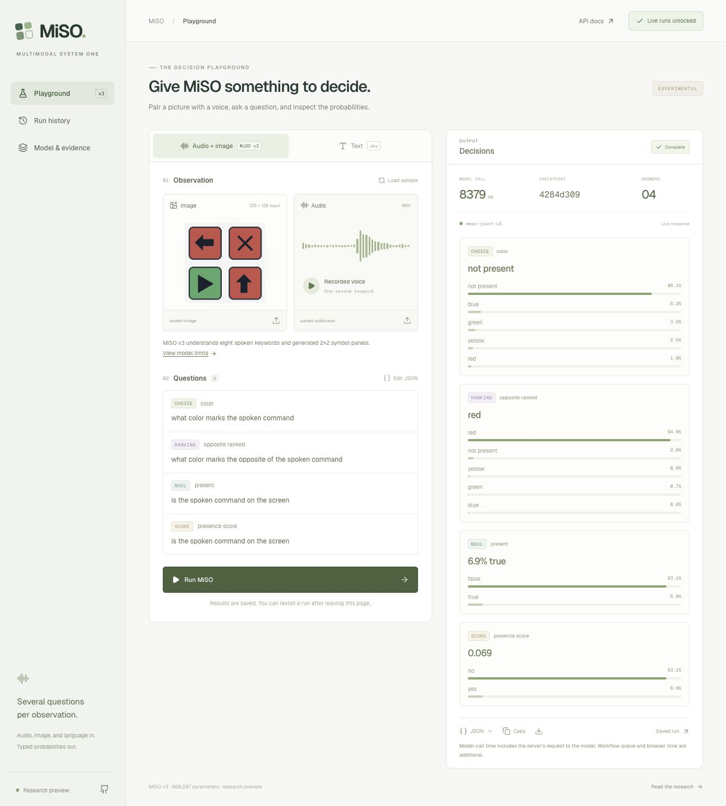

# MiSO playground deployment verification

Historical initial deployment. The [current playground is MiSO-only](../playground-miso-only-v1/README.md); comparison-model UI and execution were removed.

The [MiSO playground](https://miso-playground-nine.vercel.app) is published on Vercel. It uses React Server Components for page composition and server-side session checks, with a real `use workflow` / `use step` path for durable model calls and saved result URLs. MiSO inference runs on the authenticated, scale-to-zero Modal CPU service; Jev is called from the server with its pinned version.

| User path | Observed result |
|---|---|
| Anonymous page visit | Playground and public model documentation render |
| Anonymous live run | HTTP 401; no model call |
| Owner unlock | HttpOnly session established through the UI |
| Native sample | Actual v3 checkpoint returned Choice, Ranking, Noul and Score |
| Edited Jev text | Actual jev-1.13.0 returned all three requested primitives |
| Saved native run | Reopened through its own result URL |
| Production page reload | Jev input and completed response restored |
| Copy JSON | Clipboard contained the expected model and three answers, with no credential |
| Local production rebuild | A completed run remained readable in `.workflow-data/` |

[Production response records](production-runs.json) include model/checkpoint identities, raw output probabilities and hashes of the full request/result. These calls are deployment acceptance tests, not accuracy or latency benchmarks. The first recorded native call took about 8.4 seconds including a cold container start; the Jev server request took about 276 ms. The earlier 3.64 ms warm GPU measurement excludes these serving boundaries and is not a playground latency promise.

The displayed Jev input-token cost for this request was $0.000018354 at the checked $0.042/M rate. This does not include Vercel or Modal infrastructure billing. Live calls are restricted to an owner session; provider and session credentials are stored as server secrets, outside source and browser bundles.

## Fixes verified during implementation

The initial local session origin check compared against Next's normalized `localhost` URL while the browser used `127.0.0.1`. The check now uses the actual Host header and protocol, with a regression test for foreign origins.

The Workflow Next integration initially chose `.next/workflow-data`, which was cleared by a production build. Local configuration now selects `.workflow-data` outside build output. A real completed run was read again after rebuilding, with its original request intact. [Local persistence check](local-persistence.json). Vercel uses its managed Workflow store independently of local files.

The build, type checks and four focused tests passed. The dependency audit reports zero known vulnerabilities after pinning patched, compatible transitive `undici` and `nanoid` versions. UI verification used the in-app browser on the local server and the production site. Media upload and JSON download controls are implemented; the recorded end-to-end media run used the shipped public sample files.

See [architecture, setup, data handling and operating limits](../../docs/playground.md).

The [final deployment check](final-deployment.json) also verifies a new Workflow run on the updated app and unchanged stored results across redeployment.
