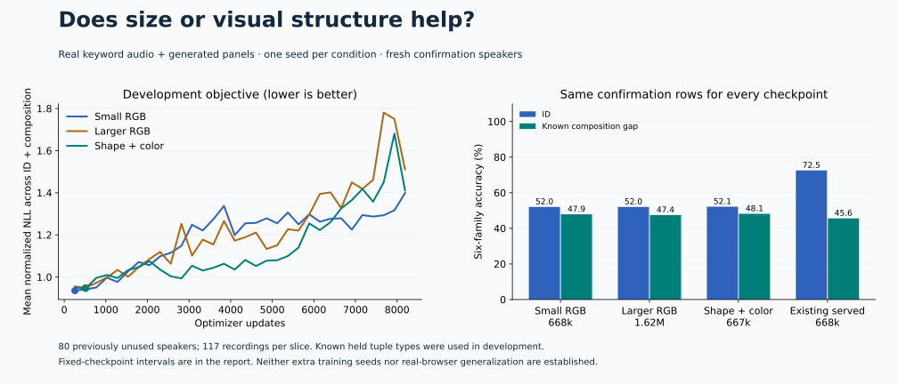

# Scale and visual-prior study

**Neither intervention established a compositional gain, and no new checkpoint replaces the served model.** The 2.42× larger model and the small factorized visual model finish near the matched small baseline. All three selected checkpoints lose about 20 percentage points of ID accuracy against the existing served checkpoint on identical fresh confirmation rows.

Three predeclared training conditions compare model size with a targeted visual prior. The existing served checkpoint is a frozen reference on the same new confirmation examples.



| Condition | Parameters | Budget updates (selected checkpoint) | Train seconds | Selected epoch | ID accuracy | Composition accuracy |
|---|---:|---:|---:|---:|---:|---:|
| Small RGB | 668,097 | 8,192 (256) | 319.7 | 1 | 51.99% | 47.86% |
| Larger RGB | 1,616,001 | 8,192 (512) | 375.5 | 2 | 51.99% | 47.44% |
| Factorized shape/color | 666,769 | 8,192 (512) | 330.6 | 2 | 52.14% | 48.15% |
| Existing served checkpoint | 668,097 | 8,822 (8,448) | Earlier study | 33 | 72.51% | 45.58% |

Development nominated **scale-small-v1** by mean normalized NLL across the ID and compositional development slices before confirmation was opened. Every condition is retained, including inferior or incomplete outcomes. The default served model remains `joint-full-v2`.

The new training attempts each consume the same 8,192-update budget and sampled data stream. Development selects among epoch checkpoints, so selected weights may represent different numbers of updates, shown in parentheses. FLOPs and time are not matched. The older served checkpoint used a different seed, an ID-only selection objective, and more updates; it is an operational reference, not the matched size control.

The new selector chose early checkpoints because later training made the models increasingly overconfident on the known composition shift. The visual prior eventually improved ID development accuracy, but its shifted normalized NLL deteriorated. A color-invariant intermediate image view did not establish compositionally reliable final decisions. This does not prove scaling or factorization never helps; it is one bounded, single-seed outcome with this optimizer and representation.

## Paired fixed-checkpoint differences

| Candidate | Reference | Slice | Difference (percentage points) | Speaker-cluster 95% interval |
|---|---|---|---:|---:|
| scale-small-v1 | scale-served-reference-v1 | in_distribution | -20.51 | [-26.70, -14.51] |
| scale-small-v1 | scale-served-reference-v1 | compositional | +2.28 | [-3.14, +7.84] |
| scale-large-v1 | scale-small-v1 | in_distribution | +0.00 | [-0.68, +0.72] |
| scale-large-v1 | scale-small-v1 | compositional | -0.43 | [-1.40, +0.57] |
| scale-large-v1 | scale-served-reference-v1 | in_distribution | -20.51 | [-26.79, -14.42] |
| scale-large-v1 | scale-served-reference-v1 | compositional | +1.85 | [-3.27, +7.18] |
| scale-factorized-v1 | scale-small-v1 | in_distribution | +0.14 | [-0.45, +0.80] |
| scale-factorized-v1 | scale-small-v1 | compositional | +0.28 | [-0.45, +1.10] |
| scale-factorized-v1 | scale-served-reference-v1 | in_distribution | -20.37 | [-26.54, -14.51] |
| scale-factorized-v1 | scale-served-reference-v1 | compositional | +2.56 | [-2.82, +7.99] |

Intervals use 2,000 paired bootstrap resamples over 80 speaker clusters. These are exploratory comparisons of fixed checkpoints, without correction for multiple comparisons. They do not estimate training-seed variability.

## What the test means

Confirmation uses 117 human recordings from 80 speakers absent from every previous manifest. Each recording has a new ID panel and a new panel containing held command/color combinations, for 702 primary questions per slice. Related questions and repeated recordings are not independent samples. All held tuples are excluded from training.

**The composition gap is already known.** Its eight tuple identities were exposed by the earlier 45.66% failure and now appear in development. This test measures the same gap on fresh speakers/images, not transfer to previously unexamined gap identities. It contains generated panels, not real screenshots. The old real-screen grounding failure remains unresolved.

The factorized visual encoder imposes a fixed dark-ink threshold suitable for this renderer. It separates a learned shape CNN from a spatially pooled color MLP. No transcript, scene metadata, symbolic labels, or oracle enters inference. This controlled prior is not a general segmentation model.

The next development question is how to train stable perception and cross-modal binding before committing more compute. Repeated development seeds and a perception/binding curriculum are testable follow-ups. A new real-screenshot confirmation set is still needed for browser claims; these results do not justify increasing production scope.

## Evidence

- [Design, sources and reproduction](../../docs/research/scale-study.md)
- [Frozen protocol](../../evals/scale-protocol-v1.json) and [pre-test nomination](../../evals/scale-nomination-v1.json)
- [Dataset audit](../../evals/acquisition/scale_panels_v1.json) and [summary with intervals](summary.json)
- [Small training](../scale-small-v1/training.json) and [evaluation](../scale-small-v1/evaluation.json)
- [Larger training](../scale-large-v1/training.json) and [evaluation](../scale-large-v1/evaluation.json)
- [Factorized training](../scale-factorized-v1/training.json) and [evaluation](../scale-factorized-v1/evaluation.json)
- [Frozen served reference evaluation](../scale-served-reference-v1/evaluation.json)

```sh
uv run python scripts/check_scale_results.py
uv run python scripts/summarize_scale_results.py
uv run --group docs python scripts/render_scale_results.py
```
