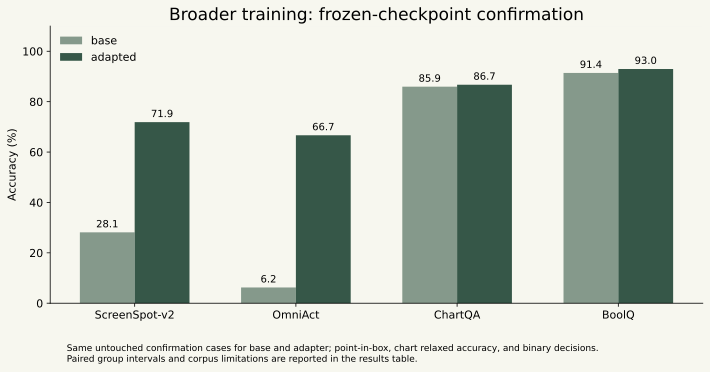
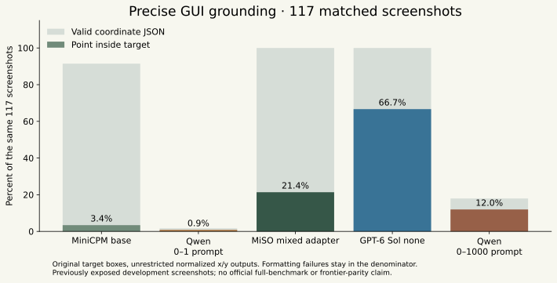
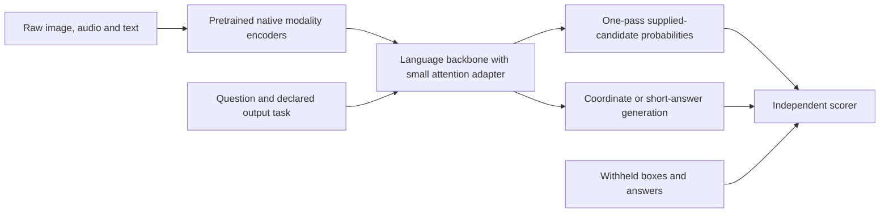

# MiSO v4: valid grounding and broader training

Completed September 26, 2026. **The mixed adapter substantially improves precise
pointing on untouched confirmation cases, with the backbone still about 9B
parameters.** Training adjusted 3.83M adapter parameters over 1,024 fixed updates
and took 401 seconds on one H100. The adapter is merged for evaluation, so it
does not add inference layers. This remains a research experiment; the live
playground still serves v3.

| Untouched confirmation | Unchanged base | Mixed adapter |
|---|---:|---:|
| ScreenSpot-v2, 96 desktop/web targets | 27/96 · 28.1% | **69/96 · 71.9%** |
| OmniAct, 96 withheld application/site cases | 6/96 · 6.3% | **64/96 · 66.7%** |
| ChartQA, 128 questions | 110/128 · 85.9% | 111/128 · 86.7% |
| BoolQ, 128 passage decisions | 117/128 · 91.4% | 119/128 · 93.0% |

The separate, exposed image/audio regression improves from 54/64 to 60/64.
Observed accuracy on the exposed audio/text regression subsets holds steady or
improves slightly; these samples do not prove universal non-regression.

**Speed remains a tradeoff:** median local H100 coordinate latency rises from
643 to 733 ms on ScreenSpot-v2 and 563 to 682 ms on OmniAct. These are warm,
sequential file-to-output measurements, excluding network and cold loading.
The coordinate branch still generates text. Do not present this adaptation as
a per-request speedup or a decoder-free System One spatial head.



The [results tables](RESULTS.md), [frozen protocol](../../evals/v4-grounding-training-protocol-v1.json),
[data acquisition](../../evals/acquisition/v4_grounding_training_v1.json), and
[oracle/split checks](data-validation.json) provide the evidence. Confirmation
results must come from the fixed final checkpoint, never a development-selected
intermediate checkpoint.

The [cost/shutdown audit](cost-and-shutdown.json) records **$4.2473 in metered
Modal compute** and **$0.7902 in new OpenAI API usage estimates**, about $5.04
for this round. All nine study apps are stopped. Metered charges can lag and
cached model storage remains; these amounts are not a production serving price.

Validation: **117 unit tests passed**. The [study audit](validation.json) verifies
all 1,024 training updates, 4,108 retained self-hosted predictions, 373 OpenAI
reference predictions, checkpoint hashes, confirmation membership, regenerated
scores and complete study shutdown. The original failed and superseded runs
remain available.

## What is now measured correctly

The model receives the raw screenshot and instruction and returns normalized
`x,y` coordinates. A prediction succeeds only when the point falls inside the
original target box. Invalid JSON, out-of-range coordinates, failed calls and
misses remain in the denominator. There is no snapping, clipping, answer-derived
crop or inference-time annotation input.

Every one of the **1,173 point labels** in the corpus is representable by the
coordinate contract and passes an oracle round trip through the exact parser
and scorer. This repairs the earlier action-space defect: the old nine grid
centers could not hit any of their 117 targets, so that zero was not a model
quality measurement. [Earlier correction](../v4-iteration-v2/grounding-action-space-audit.json).

The valid MiniCPM baseline reaches **4/117** precise targets on the exposed
ScreenSpot-Pro diagnostic and **11/96** on held-out OmniAct application groups.
GPT-6 Sol with reasoning disabled reaches **78/117** on the same ScreenSpot-Pro
inputs. The latter is a real grounding gap under this input/output setup, not
the former impossible-control result.

Qwen's first generative attempt was invalid because its Thinker-only call did
not inherit the text EOS setting from the full Omni wrapper. Its publisher
generation configuration primarily configures the Talker. We reproduced the
repeated-output/token-cap behavior, supplied tokenizer EOS **151645** explicitly,
and reran it. [Correction record](qwen-generation-correction.json). The earlier
single-pass classification mechanism does not use generation stopping rules.

Qwen also frequently emits 0–1000-like values when asked for 0–1 coordinates.
The separate [coordinate-convention control](../../evals/v4-native-coordinate-reference-v1.json)
explicitly requests 0–1000 coordinates and divides validated outputs by 1000.
Units are declared before inference, never guessed from a prediction or target.
Its prompt was frozen before any confirmation model calls. The original
normalized-contract training nomination remains unchanged; this exploratory
control is not a retrospective rewrite of the selection rule. The publisher's
[grounding cookbook](https://github.com/QwenLM/Qwen3-Omni/blob/main/cookbooks/object_grounding.ipynb)
also interprets bounding boxes on a 0–1000 scale. Our point control obtains
36/96 ScreenSpot-v2 and 32/96 OmniAct confirmation hits, with only 37/96 and
38/96 structurally valid outputs. This exposes a remaining format-contract
problem; it must not be interpreted as an intrinsic vision ranking.



On the harder exposed ScreenSpot-Pro diagnostic, the trained adapter reaches
25/117 while GPT-6 Sol reaches 78/117. **The 71.9% ScreenSpot-v2 result is a
different benchmark and does not establish OpenAI parity.**

## Does the model use image content?

A separate [image-removal control](../../evals/v4-image-ablation-protocol-v1.json)
keeps the 96 ScreenSpot-v2 instructions and image dimensions but replaces every
pixel with uniform gray. Agreement with the original target boxes falls from
27/96 to 1/96 for the base, and from **69/96 to 2/96** for the trained adapter.
The improvement therefore depends on image content in this diagnostic.

The blank images contain no visible targets, so their numbers are reference
agreement, not grounding accuracy. Both models still return valid coordinates
on all blank cases; this does not demonstrate absent-target detection or safe
abstention. Real browser execution needs that separate check.

## Broader, separate training data

| Training source | Examples | Purpose |
|---|---:|---|
| OmniAct | 768 | Pointer localization from screenshots and natural instructions |
| ChartQA | 384 | Reading and reasoning about charts with original free answers |
| BoolQ | 384 | Decisions from natural passages and yes/no questions |
| Existing native audio/joint replay | 192 | Speech intent, sound events and paired image/audio retention |
| **Total** | **1,728** | Mixed supervised adaptation |

GUI source scripts are parsed as data using a restricted AST parser; none is
executed. Only a single literal pointer action is eligible. Source naming and
annotation-schema variants are handled explicitly. Invalid or multi-action
records are omitted with recorded reasons. The GUI partitions contain **35
training, 7 development and 6 confirmation website/application groups**. Exact
image bytes and decoded pixels are kept out of competing partitions and the
new training corpus excludes protected public-audit images.

Chart training uses one pinned source shard. Development and confirmation use
the original validation/test sources with image-identity deduplication. BoolQ
uses disjoint normalized passages; its accessible publisher mirror omits article
titles, so broader article-disjointness is not claimed. The title-bearing source
download returned HTTP 403; no access control was bypassed.

The **448-case confirmation** consists of 96 newly selected desktop/web
ScreenSpot-v2 targets, 96 withheld OmniAct cases, 128 chart questions and 128
BoolQ questions. ScreenSpot-v2 uses pixel **xywh** boxes; the loader converts
them explicitly to xyxy and verifies image bounds. The old 117 ScreenSpot-Pro
screens are development diagnostics and are never called fresh confirmation.

The exposed regression subsets contain 128 MMAU, 120 MMStar and 112 MMLU-Pro
cases. They are not training data, and their scores should only be compared
within this study's identical case lists. Upstream pretraining contamination is
unknown.

Sources: [OmniAct](https://huggingface.co/datasets/Writer/omniact),
[ChartQA](https://github.com/vis-nlp/ChartQA),
[BoolQ](https://github.com/google-research-datasets/boolean-questions),
[ScreenSpot-v2](https://github.com/OS-Copilot/OS-Atlas).

## Training and output paths

The [nomination](../../evals/v4-grounding-training-nomination-v1.json) follows the
predeclared rule: use the smaller MiniCPM unless Qwen improves pooled development
point accuracy by at least ten percentage points under the normalized contract.
This selected MiniCPM. It does not establish that MiniCPM has universally better
vision or that Qwen's native coordinate convention is unsuitable.

The experiment runs **1,024 fixed AdamW updates** with rank-8 LoRA on language
attention query/value projections. Existing vision/audio encoders and original
weights stay frozen. Four of every eight updates supervise points, two supervise
chart answers, one supervises BoolQ and one uses native audio/joint replay.
Only the final checkpoint is evaluated; there is no early stopping or best-dev
checkpoint selection. Training and evaluation run as separate bounded jobs.



Choice tasks retain the direct candidate-probability path. Coordinates and chart
answers use bounded autoregressive generation in this capability experiment.
**This is not yet a decoder-free spatial head or a final System One latency
claim.** A future direct spatial head needs its own accuracy and timing
comparison. Model timing includes file decode, preprocessing, encoders, language
inference and CPU output; hosted reference timing additionally includes network
and provider work.

## Chart scoring needs a careful interpretation

The frozen primary score uses 5% numeric tolerance and otherwise
case-insensitive exact text. It is sensitive to units and formatting: the source
label `16` and an answer `16%` can disagree under common relaxed-accuracy
implementations. The retained [formatting diagnostic](chart-format-diagnostic.json)
is explicitly post hoc. It strips simple display-unit text from a single number
without rescaling it and cannot establish semantic correctness or a leaderboard
ranking. It is not substituted for the primary score.

The baseline MiniCPM has 108/128 strict chart successes. GPT-6 Sol has 50/128;
the post-hoc formatting diagnostic changes these to 109/128 and 99/128,
respectively. **The raw gap must not be presented as a comparable intelligence
advantage.** Training can improve answer formatting as well as perception;
interpret any later gains accordingly. [Metric reference](https://github.com/google-research/pix2struct/blob/main/pix2struct/metrics.py).

## Reconstructing and verifying the experiment

```bash
uv sync --locked --group research --group cloud --group docs --group dev
uv run --group research python scripts/fetch_v4_training_sources.py
# Restore earlier frozen media/public-audit data first when starting fresh.
uv run --group research python scripts/prepare_v4_training.py
uv run --group research python scripts/check_v4_training_data.py
uv run --group docs --group research python scripts/report_v4_grounding.py
# The complete owner-side audit also verifies the private adapter tensor:
uv run --group research python scripts/check_v4_grounding_study.py
```

Bundles are immutable and addressed by their content hash, preventing the
previous upload/build race. The first attempt failed because the remote module
tried to read a local-only bundle pointer; that attempt is preserved. Each GPU
job has a timeout, zero retries, one container, and no persistent endpoint. The
study allows at most eight standard GPU calls plus one short image-ablation
call. The latter has a 600-second runtime and 300-second startup bound; all nine
maximum reservations still fit the unchanged **$45** ceiling. The budget
amendment is recorded in the image-ablation protocol. The OpenAI reference
remains inside the existing cumulative $2 cap.

Weights and base checkpoints stay in the existing Modal volume. New adapter
tensors are retained locally but excluded from Git; configurations, hashes,
code, predictions and traces are published. Source terms include MIT OmniAct,
GPL-3.0 ChartQA metadata, CC-BY-SA-3.0 BoolQ and noncommercial SLURP audio replay.
The adapter is research-only and is not commercially cleared by this repo's
code license. The completed GPU campaign's ledger is closed; new training or
GPU reproduction requires a new versioned campaign and explicit budget. Preserve
these original attempts and reservations instead of deleting them to reset the
counter. The frozen source-acquisition and model-runner code is included.

Point-in-box success is not a complete browser workflow. Some source elements
are visually locatable beneath modal overlays but would not receive a live
click. Absent-target handling, application-state success, actual PDF/XLSX
ingestion and real mixed spoken-screen tasks remain separate acceptance work.
There is no automatic playground promotion or frontier-parity claim.
