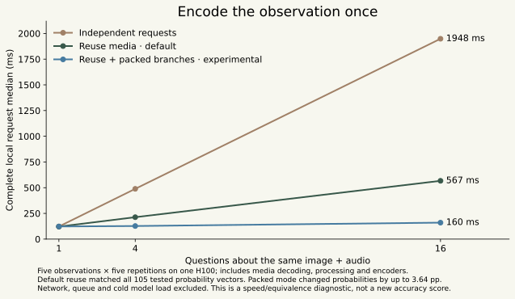
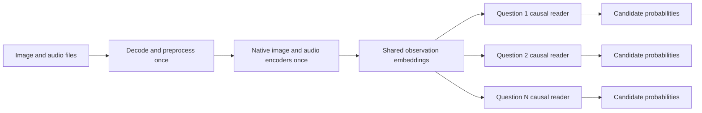
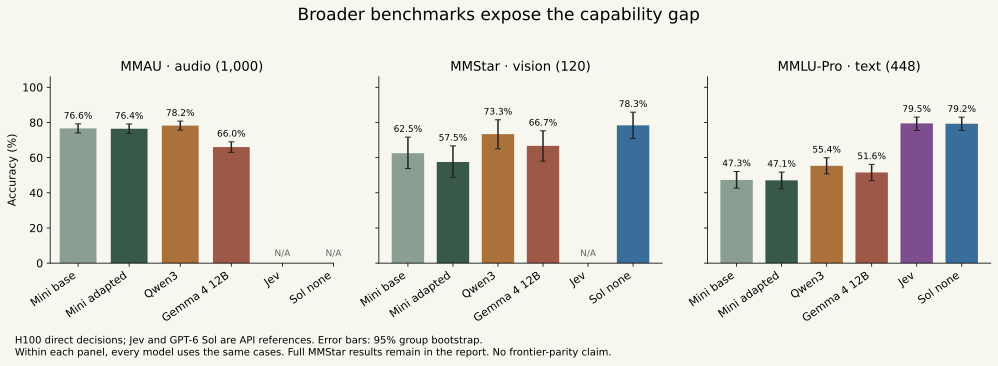

# MiSO v4: broader evaluation and complete-request optimization

Follow-up: the [September 26 grounding/training study](../v4-grounding-training-v1/README.md) now measures real coordinate outputs and a broader mixed-task adapter. This report preserves the earlier audit.

September 25, 2026. **This iteration improves reuse speed and exposes substantial capability gaps. It does not establish frontier parity or release a new playground model.** The earlier 82.35% five-track confirmation score measured a much narrower task distribution.

**Correction to the click result:** the earlier 0/117 grid-center statistic cannot measure the model's vision or grounding ability. **None of the nine allowed points lies inside any of the 117 target boxes. Even an oracle would score zero.** The [action-space audit](grounding-action-space-audit.json) records this defect. Coarse region classification remains a valid separate result; precise GUI grounding has not yet been validly evaluated. Original run files are preserved.

The [generated results](RESULTS.md), [machine-readable results](summary.json), [frozen protocol](../../evals/v4-iteration-protocol-v2.json), and [complete coverage requirements](../../evals/frontier-scorecard-v1.json) keep measured capabilities separate from work still needed. All predictions, failed attempts, protocol amendments, source hashes and cost records are retained in this directory.

**Working decision:** Qwen3-Omni is the stronger broad-accuracy reference; MiniCPM is the smaller, faster engineering reference. Qwen improved text accuracy from the adapted MiniCPM's 47.10% to 55.36%, and full MMStar from 63.40% to 70.13%. Jev and GPT-6 Sol reached 79.46% and 79.24% on the matched text questions. More training is needed before either open backbone meets that quality target. The study consumed **$1.9852 of metered Modal compute**, about **$0.5405 in OpenAI inference**, and **$0.0108 in Jev inference**, including the failed Jev attempt and diagnostic. Metered cloud charges can lag. Every recorded Modal app is stopped; cached weights remain on the existing volume.

## A faster complete decision request

The new [shared-observation adapter](../../mmso/shared_observation.py) decodes, preprocesses and encodes a common image/audio observation once. Each independent question receives the exact media representation and its own question tokens. The conservative default runs the language branches separately. Across five different observations and 1, 4 or 16 questions, all **105 tested probability vectors matched the independent-request baseline exactly**.

For 16 questions, median complete local latency fell from **1,948 ms to 567 ms: 3.44× faster**. One-question latency stayed about 122 ms. The default optimization is valuable when multiple decisions concern the same observation; it is not a single-question speedup.

An optional experimental mode also packs independent causal branches into one language forward. It reached **160 ms, or 12.18× faster**, retaining all 105 top choices. However, probabilities differed by up to **0.0364** and question reordering by up to **0.0121**. That matters for confidence thresholds. `packed=True` remains experimental; numerical agreement on a tiny fixture set is not a calibration or accuracy guarantee.



Both paths include local file reading, image/audio decode, resampling, preprocessing, model encoders, question compilation, language inference and CPU output transfer. Packed mode also includes constructing the attention mask. These are warm, single-H100 measurements, excluding network, queueing and cold model loading. The earlier 6.53× diagnostic excluded preprocessing and media encoders; the new timing boundary is substantially more useful but still is not a public API SLA.



The optional packed mask allows each question to attend to the shared prefix and its own suffix only. Positions reset per branch. The implementation rejects differing prefixes, media tokens extending into a question branch, and token-budget overflow. GPU hooks verified one image-encoder and one audio-encoder call per optimized request, versus sixteen of each in the 16-question independent baseline. The intermediate baseline, which shares media but still runs language separately, makes the source of each speed gain explicit.

## Broader quality audit

The new public audit contains **2,948 cases**. None were used to train or calibrate MiSO in this study:

| Benchmark | Coverage | What it measures | Source |
|---|---:|---|---|
| MMStar | All 1,500 validation cases | Six visual skills, including fine perception and visual reasoning | [Publisher repository](https://github.com/MMStar-Benchmark/MMStar) |
| MMAU test-mini | All 1,000 pinned cases | Speech, environmental sound and music reasoning | [Publisher repository](https://github.com/Sakshi113/MMAU) |
| MMLU-Pro | 448, 32 per subject | Harder text decisions across 14 subjects | [Publisher repository](https://github.com/TIGER-AI-Lab/MMLU-Pro) |

We retain original choices and labels. We do not invent answer-derived distractors. The MMLU-Pro run is a zero-shot direct-answer subset, and must not be labeled as the full few-shot chain-of-thought leaderboard score. MMAU is tied to the exact publisher dataset revision, not an assumed interchangeable benchmark version. MMStar's official multimodal-gain/leakage submission protocol has not been reproduced.



The original MiniCPM backbone and the existing adapter run on every case, with the same image size, 16 kHz mono audio, 120-second duration ceiling, 8,192-token budget and candidate-code scoring. No long audio was silently clipped. The adapter uses its previously frozen temperature; the base uses temperature one. Accuracy comparisons are unaffected by temperature; probability-quality comparisons include this calibration difference.

The [Qwen extension](../../evals/v4-iteration-amendment-v1.json) was explicitly added **after** inspecting MiniCPM and Jev results, followed by a [Gemma 4 12B check](../../evals/v4-iteration-amendment-v2.json). These are exploratory checks of cached alternatives, not preregistered new winners. The unchanged public cases are now exposed regression/audit data. Any subsequent training or model-selection claim needs a newly frozen confirmation set.

Failure and unsupported cases stay in accuracy denominators. We report per-benchmark and per-skill accuracy, image/audio/question-group bootstrap intervals, NLL, Brier, fixed-bin ECE, confidence-threshold accuracy/coverage, and full local pipeline latency. We do not average these unrelated datasets into a single frontier-intelligence number. Source IDs and hashes are checked in; the source questions and media can be reconstructed locally with `scripts/prepare_v4_frontier.py`.

Exact media hashes do not overlap the v4 training set. This is not semantic deduplication, and upstream pretraining contamination remains unknown. MMAU is CC-BY-NC-4.0 and is evaluation-only. The existing MiSO adapter remains noncommercial research because its SLURP training audio is noncommercial. MMStar lacks an explicit dataset-card license; this repository does not redistribute its source questions or media.

## Jev and OpenAI are measured references

Jev `jev-1.13.0` receives exactly the same 448 MMLU-Pro questions and choices. Its **79.46%** answer accuracy is substantially above both MiniCPM variants' approximately 47%. That gap was obscured by the earlier four-template policy controls. This is an independent text benchmark, not TypeSafe's official workflow suite.

The first Jev attempt stopped because its strict probability validator rejected a response summing to 0.99. A separate, preserved diagnostic reproduced the condition. The corrected audit separates **valid selected answers** from **valid probability distributions**: all 448 answers were usable, while 14 distributions failed the strict probability contract. Those distributions are retained raw, never silently renormalized, and excluded from proper probability scores and confidence-based selection. The existing production-style Jev adapter still validates strictly by default.

The [OpenAI protocol](../../evals/v4-openai-protocol-v1.json) caps total reference spend at **$2**. GPT-6 Sol with reasoning `none` is a latency-oriented reference on the same 448 text cases and 120 stratified MMStar cases. A separate GPT-6 Astra `medium` pilot covers just one question per subject/visual category, 20 total, with a bounded reasoning output. Truncations and refusals count as failures. Twenty questions cannot establish broad frontier parity. Native audio is unsupported by these two endpoints and is not replaced with a transcript. [Official model guidance](https://developers.openai.com/api/docs/guides/latest-model), [pricing](https://developers.openai.com/api/docs/pricing).

OpenAI returns a schema-constrained choice. We do not request invented confidence or score it as a probability model. API latency includes network/provider work; MiSO's local H100 timing excludes it. They must not share an unlabeled latency frontier. Cost estimates include the cache-write premium and conservatively ignore cache-read discounts; uncertain charges retain their reservation. The initial run summaries omitted that premium: the retained [cost correction](openai-cost-correction.json) supersedes their cost fields without altering predictions. The two OpenAI runs total **$0.5405** at the published standard rates. Keys remain in owner-only local configuration outside Git and cloud bundles.

## GUI audit: the fixed click points made success impossible

Four fixed development variants compared the original 1,536-pixel limit, 2,304-pixel detail, and fixed grid overlays at both sizes. Overlays use geometry and supplied choice letters only. Larger images and overlays did not beat the original **14/32** region score, and increased median latency. The frozen rule retained the baseline. We did not lower the gate or select a variant using confirmation answers.

We froze **117 unused screenshots**, excluding every filename and exact image hash in prior MiSO screen manifests. The target was 128; some application/type buckets lacked enough unused images, and the [acquisition record](../../evals/acquisition/v4_fresh_screens_v2.json) reports each shortfall. Applications are reused, so this is not an application-disjoint test. The retained baseline scored **60/117 (51.28%)** on regions. The change from the old 39.58% region result is a different test sample, not a demonstrated model improvement.

The original [fresh-screen record](attempts/screen-confirmation-v1/summary.json) also records whether the selected cell center lands in the target box. A subsequent feasibility audit showed that all 117 targets are unreachable by those nine points. The observed zero is guaranteed by the output restriction and supplies no evidence about the model's precise localization ability. The original report and chat summary overstated its implication. The scorer now computes an oracle action-space ceiling and marks the point metric uninterpretable when no target is reachable.

The next grounding test must let the model produce useful coordinates, boxes or element selections, then score the original point-inside-target task. First test the backbone's existing coordinate-output capability before deciding whether a new spatial head or additional GUI training is needed. [Publisher task](https://github.com/likaixin2000/ScreenSpot-Pro-GUI-Grounding).

## What remains before a frontier claim

The [coverage scorecard](../../evals/frontier-scorecard-v1.json) explicitly tracks missing MMMU-Pro and MMAU-Pro coverage; original free-answer DocVQA/ChartQA; actual PDF/XLSX ingestion; real mixed speech/screen cases; workflow/ranking outcomes; and isolated VisualWebArena/OSWorld final-state success. Documents need original ANLS/numeric scoring, not a classification task made artificially easy by supplying the true answer among invented choices.

TypeSafe's published evaluation measures agreement with a model consensus. We still need its complete versioned cases, executable workflow, reference distributions and scorer before calling any result a reproduction of that chart. Selected website examples are insufficient. [TypeSafe methodology](https://evals.typesafe.ai/).

Further model work should use separate, licensed broad decision and GUI training data, with balanced replay so specialty gains do not damage general capabilities. The current results do not justify spending the remaining budget on more repetitions of the small policy/keyword task. Deployment work also needs client-visible cold/warm latency, concurrency, allocation/utilization and cost per correct completed workflow. **The live playground remains v3.**

## Reproduce

```bash
uv sync --locked --group research --group cloud --group docs --group dev
uv run --group research python scripts/prepare_v4_frontier.py
uv run --group research python scripts/prepare_v4_fresh_screens.py
uv run --group research python scripts/prepare_v4_iteration_bundle.py
# Use a new immutable attempt name; each run consumes the bounded job ledger.
uv run --group cloud modal run cloud/modal_v4_iteration.py --phase shared-observation --attempt your-unique-attempt
uv run --group docs --group research python scripts/report_v4_iteration.py
uv run --group cloud python scripts/capture_v4_iteration_costs.py
uv run --group dev --group research python -m unittest discover -s tests -q
```

Pinned publisher weights must already be present in the original `miso-v4-selection-v1` Modal volume; the [previous study](../v4-selection-v1/README.md) documents CPU-only acquisition. Fresh-screen reconstruction also requires the pinned annotations from the earlier screen acquisition. There is no automatic model download or persistent GPU endpoint in this follow-up. [Metered costs and verified shutdown](cost-and-shutdown.json) distinguish actual usage from conservative reservations.

One screen job's local build failed because its upload bundle was rebuilt during upload. No GPU prediction was produced; the [failure record](attempts/screen-confirmation-build-v1/failure.json) is retained. Subsequent builds prepared the bundle fully before launch. Do not rewrite a bundle while a Modal upload/build is in progress.
