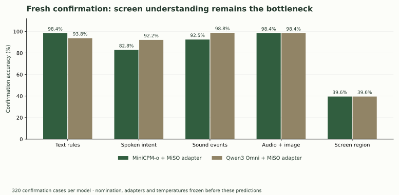
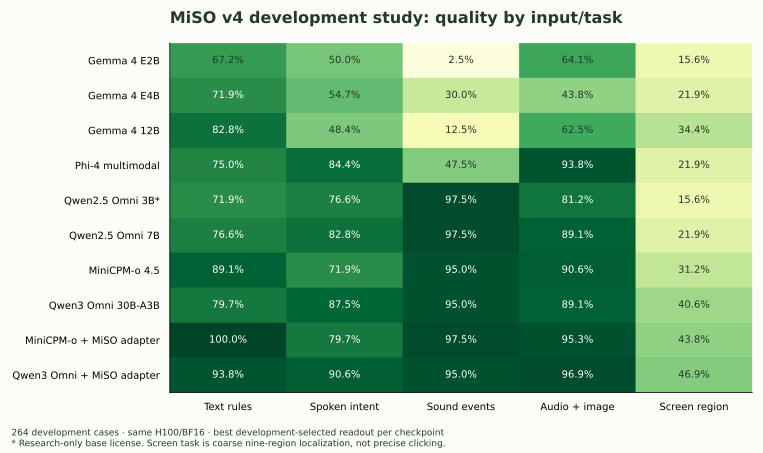
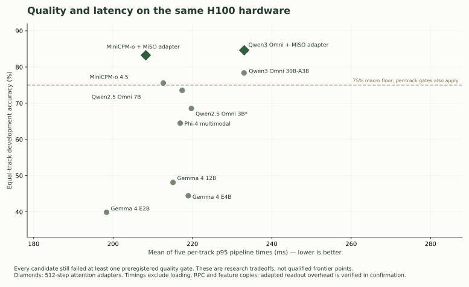
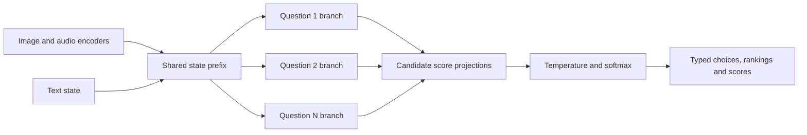
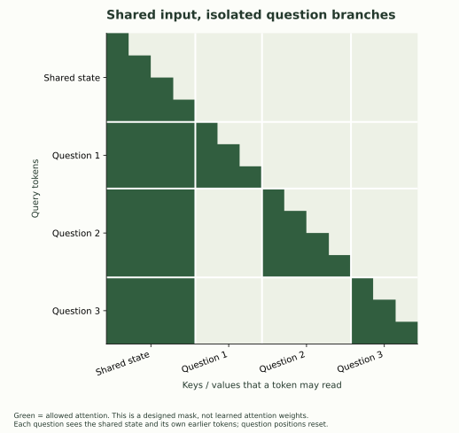

# MiSO v4 selection study

**Result: MiniCPM-o 4.5 is the provisional v4 research backbone; no candidate cleared the complete release-quality gate.** Qwen3-Omni remains the higher-accuracy reference. The investigation ran eight native text/image/audio checkpoints on matched H100 hardware, tested frozen-feature decision readouts, trained attention adapters for the two strongest eligible candidates, and evaluated their frozen versions on 320 separate confirmation cases each.

MiniCPM's confirmation macro accuracy was **82.35%**, versus **84.54%** for Qwen3. Both scored **19/48 (39.58%)** on coarse screen localization. That shared failure prevents a claim of reliable computer/browser use or general Jev/OpenAI parity. The small Gemma models were candidates in the investigation, not assumed winners.

[Machine-readable results](summary.json) · [Frozen nomination](../../evals/v4-nomination-v1.json) · [Protocol](../../evals/v4-selection-protocol-v1.json) · [Adapter follow-up](../../evals/v4-adapter-protocol-v1.json) · [Data audit](../../evals/acquisition/v4_selection_v1.json) · [Measured cost and shutdown](cost-and-shutdown.json)

## Fresh confirmation



| Task | Cases | MiniCPM + MiSO adapter | Qwen3 + MiSO adapter |
|---|---:|---:|---:|
| Executable text-rule controls | 64 | 63/64 · **98.44%** | 60/64 · **93.75%** |
| Human spoken intent | 64 | 53/64 · **82.81%** | 59/64 · **92.19%** |
| Environmental sounds | 80 | 74/80 · **92.50%** | 79/80 · **98.75%** |
| Paired audio/image control | 64 | 63/64 · **98.44%** | 63/64 · **98.44%** |
| Screen region | 48 | 19/48 · **39.58%** | 19/48 · **39.58%** |
| Equal-track macro average | 320 total | **82.35%** | **84.54%** |

The macro average weights each task equally; it is not pooled case accuracy. Group-bootstrap 95% intervals are **78.93–85.78%** for MiniCPM and **80.45–88.47%** for Qwen3. The paired MiniCPM-minus-Qwen interval is **−6.33 to +1.69 percentage points**. The experiment does not establish statistical equivalence or noninferiority within a three-point margin. Text controls are clustered by four policy families, screens by eight applications, environmental sounds by source recording, speech by utterance, and joint controls by speaker.

The nomination, adapters and calibration settings were frozen before these predictions. Neither confirmation labels nor Jev responses were used for training or retuning. [MiniCPM confirmation](attempts/minicpmo45-confirmation-v1/result.json), [Qwen confirmation](attempts/qwen3-30ba3b-confirmation-v1/result.json).

## Why MiniCPM is the research lead

| Property, matched H100 study | MiniCPM-o + adapter | Qwen3-Omni + adapter |
|---|---:|---:|
| Loaded parameters, speech generation disabled | 9.024B | 31.719B |
| Backbone hidden width | 4,096 | 2,048 |
| Measured inference peak allocated memory | 18.58 GiB | 59.76 GiB |
| Development macro accuracy | 83.25% | 84.63% |
| Mean of five task p95 pipeline times | 208.2 ms | 233.1 ms |
| Fixed 512-step adapter-training time | 188.3 s | 294.0 s |

MiniCPM had the lower measured latency and much smaller memory requirement while remaining within three points of the best development macro accuracy. That is the recorded **research-lead** rule after the full quality gate failed; it does not waive the failed gates. Qwen3 performed better on the audio confirmation tasks. A workload prioritizing speech accuracy may favor it despite its footprint.

These timings include media decode/resampling, processing, transfers, model forward and scores. They exclude model loading, network/RPC and research feature copies. “Mean task p95” averages five separate p95 values; it is not an overall API p95. MiniCPM/Phi required the supported Transformers 4.51/PyTorch 2.8 runtime; the other candidates used Transformers 5.17/PyTorch 2.14. Hardware and precision were matched, but this is not a comparison of every possible optimized serving engine.

## Candidate screen and training intervention



| Candidate / best tested readout | Text | Speech | Sounds | Joint | Screen | Macro |
|---|---:|---:|---:|---:|---:|---:|
| Gemma 4 E2B | 67.2% | 50.0% | 2.5% | 64.1% | 15.6% | 39.9% |
| Gemma 4 E4B | 71.9% | 54.7% | 30.0% | 43.8% | 21.9% | 44.4% |
| Gemma 4 12B Unified | 82.8% | 48.4% | 12.5% | 62.5% | 34.4% | 48.1% |
| Qwen2.5-Omni 3B, research-only license | 71.9% | 76.6% | 97.5% | 81.2% | 15.6% | 68.6% |
| Qwen2.5-Omni 7B | 76.6% | 82.8% | 97.5% | 89.1% | 21.9% | 73.6% |
| Qwen3-Omni 30B-A3B | 79.7% | 87.5% | 95.0% | 89.1% | 40.6% | 78.4% |
| MiniCPM-o 4.5 | 89.1% | 71.9% | 95.0% | 90.6% | 31.2% | 75.6% |
| Phi-4 multimodal | 75.0% | 84.4% | 47.5% | 93.8% | 21.9% | 64.5% |
| **Qwen3 + attention adapter** | **93.8%** | **90.6%** | **95.0%** | **96.9%** | **46.9%** | **84.6%** |
| **MiniCPM + attention adapter** | **100.0%** | **79.7%** | **97.5%** | **95.3%** | **43.8%** | **83.3%** |

Every row uses 264 development cases. These are **our custom tasks and inference recipe**, not the publishers' official benchmark scores. Each backbone was screened using direct candidate-letter logits and three train-only residual readouts, with temperature calibrated on a separate partition. Each of the two nominated finalists then received the same rank-8, alpha-16, 512-update attention-adapter recipe. Only language attention projections were trained; existing vision/audio weights remained frozen. Adapters were merged before evaluation. The same readout/calibration procedure was repeated afterward.

The training pool contained 496 cases, calibration 152, development 264 and confirmation 320. Equal-task adapter sampling revisits small task pools; the training traces record every example actually used. The final fixed-step checkpoint was used, with no development-selected early checkpoint. [Candidate revisions and licenses](../../evals/v4-candidates-v1.json), [MiniCPM adapter trace](attempts/minicpmo45-adapter-v1/training.jsonl), [Qwen adapter trace](attempts/qwen3-30ba3b-adapter-v1/training.jsonl).



## A concrete System One speed improvement

The v4 direction computes distributions directly and shares expensive state processing across independent questions:





The [working packed-question prototype](../../mmso/parallel_decisions.py) uses a causal shared prefix, isolated question branches, and reset question positions. In the controlled H100 probe:

| Distinct questions over one observation | Sequential, media already cached | Packed shared prefix | Speedup |
|---|---:|---:|---:|
| 1 | 21.10 ms | 21.29 ms | 0.99× |
| 4 | 81.25 ms | 23.70 ms | 3.43× |
| 16 | 341.91 ms | 52.33 ms | **6.53×** |

All **16/16 top decisions agreed** with independent execution. Maximum probability drift was **0.00533**, including the question-order check; this is approximate numerical agreement, not bitwise identity. The 16-question input reduced separately processed tokens from **4,505 to 1,235**, using a 218-token shared prefix.

Both timed paths start from prepared GPU embeddings and already reuse media-encoder results. Timings include language inference, scores and probability transfer; the packed path also includes mask construction. They exclude file processing, media encoding, networking and startup. This is one observation with sixteen distinct questions, not an end-to-end API SLA or a new accuracy result. [Complete measurements and question texts](attempts/minicpmo45-parallel-v1/parallel-summary.json).

A separate optimization retained just ten candidate-code rows of the language output projection. It reduced the loaded model from **9.024B to 8.403B parameters**, preserving all ten diagnostic probability vectors exactly on H100. This preserves the full input vocabulary; it restricts the tested output contract to the ten internal candidate codes. [Projection and batching diagnostics](attempts/minicpmo45-diagnostics-v2/diagnostics.json).

On the same unadapted MiniCPM checkpoint, ten diagnostic cases had median direct-distribution time **43.7 ms**, one-token generation **49.0 ms**, and generated probability JSON **1,108.8 ms**. Only **6/10 JSON responses** met the contract after stripping presentation/speech wrappers, so this is not evidence of a universal 25× speedup against an optimized structured-output server. It does show why single-label generation is a much stronger speed baseline than verbose JSON. The direct-scoring path was the baseline for the whole candidate study.

The stock streaming-audio path rejected batch sizes above one. Text-only prepared-input batching reached **246.7 decisions/s at batch 16** on one repeated example, excluding preprocessing and queueing. The shared-prefix prototype is a separate way to answer multiple questions within a single multimodal observation; the two measurements must not be conflated.

Literal text tokenization was a small part of the measured cost. On MiniCPM confirmation cases, the question/option tokenizer probe had medians of **0.38 ms for text**, **0.36 ms for speech questions**, and **0.61 ms for screen questions**. Corresponding model-forward medians were **26.3, 49.3 and 132.0 ms**. Screen decode/resize and native processing added substantial work. The tokenizer probe omits media-placeholder expansion; the processor measurement includes actual tokenization. These are not measurements of Jev's private input pipeline. [Stage measurements](stage-timings.json).

## Modal hardware and cost

The MiniCPM candidate completed the ten-case hardware probe on a **24 GB L4** in BF16. The reduced output projection peaked at **17.35 GiB allocated / 19.23 GiB reserved**. All ten top decisions matched H100, but probabilities differed by as much as **0.0474**, so L4 calibration/quality is not established by this small parity check. Model loading plus adapter merge took about **34 seconds**, outside warm request timing.

| Warm diagnostic pipeline, reduced output projection | H100 median | L4 median |
|---|---:|---:|
| Text rules | 22.1 ms | 82.7 ms |
| Spoken intent | 38.4 ms | 118.3 ms |
| Environmental sounds | 43.3 ms | 126.7 ms |
| Audio + image | 109.8 ms | 539.9 ms |
| Screen region | 420.3 ms | 1,601.8 ms |

The L4's lower hourly price did not make every task cheaper: the continuously busy resource proxy was slightly worse for screens and worse for the joint input than H100, while it favored L4 for audio. These are planning proxies using measured warm medians and requested CPU/RAM, not actual serving bills. [Hardware comparison and assumptions](hardware-comparison.json), [Modal resource pricing](https://modal.com/pricing).

Provider-metered study spending, including failed attempts, and direct lifecycle checks are captured in [cost-and-shutdown.json](cost-and-shutdown.json). Billing can lag. The study reserved 23 GPU jobs within its 24-job / $250 ceiling. Checkpoints remain in a dedicated Volume; no persistent GPU endpoint was deployed.

## Jev reference and interpretation

Jev `jev-1.13.0` answered **62/64** on the same development text controls for **$0.001040256** in returned input-token usage. Adapted MiniCPM answered 64/64 and adapted Qwen3 60/64 on those development cases. The MiSO adapters were trained on these policy families; Jev was evaluated without task-specific training here. These results do not establish general language-intelligence parity.

Jev's median client-visible API latency was **326.6 ms**. Our H100 pipeline measurements exclude networking and serving overhead, so the numbers cannot become a same-hardware frontier comparison. These are original controls, not the publisher's four workflow benchmarks. No OpenAI API quality run was performed, and no Jev output was used as training data. [Reference evidence](jev-text-reference-v1/result.json), [publisher's workflow methodology](https://typesafe.ai/blog/introducing-system-one-models-and-jev).

## Boundaries and next v4 work

- **Keep MiniCPM as the working research base and Qwen3 as the quality reference.** The confirmation difference is uncertain; neither met the screen gate. No model has been promoted into the public playground.
- **Prioritize UI data and visual specialization.** The screen metric is only nine-region localization and still reaches 39.6%. Precise clicking, completed browser workflows, unfamiliar applications, PDFs, spreadsheets and general image classification were not validated.
- **Preserve the one-pass decision interface and independent question branches.** The implementation tests 2–10 candidates, not arbitrary-cardinality schemas. The packed prototype needs broader numerical and task validation before API integration.
- **Test candidate-order robustness separately.** Candidate-code logits are a practical screening interface, not the original proposal's provably permutation-equivariant semantic candidate scorer. Randomized option order reduces a shortcut; it does not establish invariance.
- **Evaluate confidence under missing evidence and distribution shift.** Temperature scaling here is task-distribution calibration, not a validated epistemic uncertainty detector or an abstention guarantee.
- **Treat the study weights as research artifacts.** SLURP audio is CC BY-NC 4.0; the base checkpoint's permissive license does not clear a commercially deployed derivative trained on that audio. Use suitable production-training data for a commercial release. [SLURP licensing](https://github.com/pswietojanski/slurp#license).

Gemma 3n was access-blocked without a local Hugging Face credential. The long-list review also considered Mini-Omni2, OmniVinci, vision-only families and audio-only families. They were not timed in this harness: Mini-Omni2 uses a different inference stack, OmniVinci's publisher card contains conflicting license signals, and single-modality families need another architecture/training path to meet the native three-input requirement. They have no invented scores. This is a measured comparison within the stated candidate/runtime set, not proof of the globally fastest open model. [Mini-Omni2](https://huggingface.co/gpt-omni/mini-omni2), [OmniVinci](https://huggingface.co/nvidia/omnivinci).

## Reproduction and audit

All successful and failed attempts are retained under [attempts](attempts/). Media and large feature archives stay in ignored local storage and the dedicated Modal Volume. Model revisions, source hashes, prompts, per-case outputs, calibration selections, gradient traces, adapter weights and figure hashes are recorded.

```bash
uv sync --locked --group cloud --group research --group dev --group docs
uv run --locked --group research python scripts/fetch_v4_data.py
uv run --locked --group dev python -m unittest discover -s tests -q
uv run --locked python scripts/check_v4_study.py
uv run --locked --group docs python scripts/report_v4_study.py
uv run --locked --group cloud python scripts/capture_v4_costs.py
```

The local audit requires the retained feature archives, whose hashes are in each run. The [study guide](../../docs/research/v4-backbone-selection.md) describes data preparation and cloud execution. Use fresh attempt IDs and honor the nomination/test boundary; rerunning a confirmation case does not make it fresh again.

The generated panel PNGs are preserved under `evals/fixtures/v4-panels` so exact media restoration does not depend on a machine's font installation. Natural recordings and screenshots are restored from pinned public sources and checked against the original hashes.
